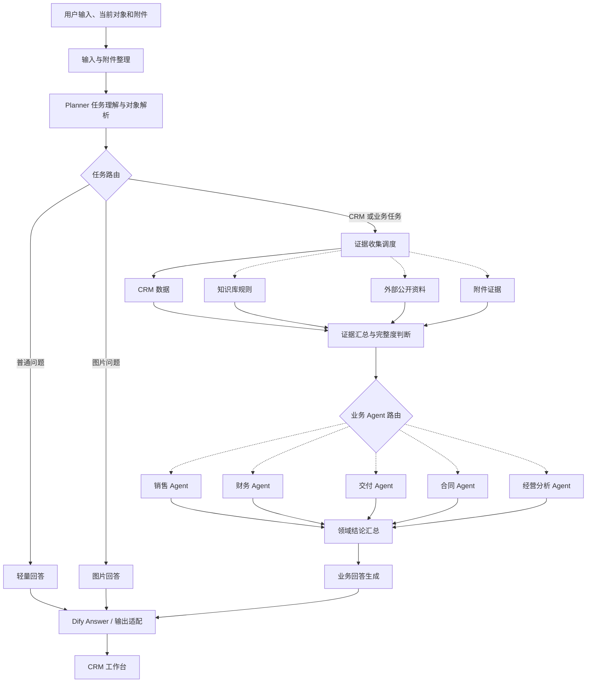

# 多Agent智能助手

`多Agent智能助手` 是嵌入 CordysCRM 的销售业务助手。系统围绕客户、商机、联系人、跟进记录和跟进计划等 CRM 对象，提供自然语言查询、进展总结、风险判断、内容草稿、跟进计划草稿和复杂商机评审能力。

CordysCRM 负责基础 CRM 业务对象与接口；多Agent智能助手负责理解用户任务，解析当前业务对象，按需读取 CRM、知识库、附件和公开资料，并组合销售、财务、交付、合同等 Agent 生成业务回答。

当前 Chatflow 不执行 CRM 写入。用户提出保存、创建跟进记录或创建跟进计划时，系统生成可复制草稿，不声称已经写入 CRM。折扣、付款、交付、合同和审批结论仍由对应业务负责人确认。

## 当前能力

| 能力 | 当前实现 |
| --- | --- |
| CRM 对象解析 | Planner 通过 `resolve_crm_object` 校验客户或商机；精确匹配优先，同等级多候选时要求用户确认。 |
| 客户与商机查询 | 读取客户、商机、联系人、跟进记录、跟进计划和统计数据，并以业务文本或表格返回。 |
| 连续对话 | 后端持久化会话和消息；前端保存当前业务对象；Planner 使用有限历史消息理解连续追问。 |
| 专项风险判断 | 根据问题按需启用销售、财务、交付或合同 Agent，不要求所有问题都进入完整评审。 |
| 多 Agent 商机评审 | 对复杂商机并行执行销售、财务、交付和合同分析，再统一生成结论、主要风险和下一步建议。 |
| 知识库检索 | Planner 根据任务语义决定是否读取内部业务规则，并结合 CRM 事实生成检索内容。 |
| 外部公开资料 | 用户任务需要公开信息时启用外部情报 Agent；回答保留可验证网页标题和原始链接。 |
| 图片与附件 | 图片或截图先生成附件摘要，再作为本轮业务判断证据。 |
| 流式回答 | 后端转发 Dify SSE；长文本回答直接进入回答节点；前端按累计 Markdown 内容增量渲染。 |
| 判断过程 | 前端根据 Dify 关键节点事件展示任务理解、资料读取、专项分析和回答生成状态；并行节点分别显示。 |
| Markdown 与图表 | 支持标题、列表、表格、代码块、链接、复制操作和 `chart` 代码块图表。 |
| 内容与计划草稿 | 生成沟通内容、跟进摘要和跟进计划草稿；当前版本不执行 CRM 写入。 |

## 页面结构

当前页面采用双栏工作台：

- 左侧为历史会话、新建会话和会话时间。
- 中间为对话、当前对象、判断过程、Markdown 回答、附件和输入区。
- 客户或商机不唯一时，在对话中返回候选列表并要求用户输入完整名称。
- 当前版本不设置固定右侧业务栏。

## 效果预览

以下截图使用演示数据，展示当前工作台的主要输出形态。

<table>
  <tr>
    <td width="50%">
      <strong>CRM 查询与连续追问</strong><br>
      <sub>查询客户或商机；对象不唯一时进行澄清；后续追问复用当前会话对象。</sub><br><br>
      
    </td>
    <td width="50%">
      <strong>经营分析与图表</strong><br>
      <sub>基于 CRM 统计数据生成业务结论，并在存在有效对比数据时渲染图表。</sub><br><br>
      
    </td>
  </tr>
  <tr>
    <td width="50%">
      <strong>外部资料与 CRM 证据</strong><br>
      <sub>公开资料作为辅助证据，与 CRM 内部事实和模型判断区分表达。</sub><br><br>
      
    </td>
    <td width="50%">
      <strong>复杂商机评审</strong><br>
      <sub>销售、财务、交付和合同 Agent 分别判断，再统一生成综合结论。</sub><br><br>
      
    </td>
  </tr>
</table>

## 系统结构


当前公开 Chatflow 包含 54 个节点和 75 条边。节点按实际任务选择执行，并非每轮都会运行全部分支。



## 目录结构

```text
CordysCRM/        CordysCRM 前后端源码及多Agent智能助手扩展
chatflows/        可导入 Dify 的公开 Chatflow 模板
demo-data/        演示数据和初始化 SQL
docs/             产品、协议、Chatflow、验收和安全文档
knowledge-base/   业务规则知识库源文件
scripts/          本地启动、数据导入和结构检查脚本
tests/            Chatflow、接口和回复质量测试脚本
```

## Chatflow 配置

公开模板位于：

```text
chatflows/ai-deal-desk-v3.example.yml
```

模板不包含个人 API Key。导入 Dify 后需要完成以下配置：

1. 配置模型供应商和模型凭据。
2. 创建并绑定知识库，配置 Embedding、Rerank、Top K 等检索参数。
3. 使用 `docs/reference/dify/AI Deal Desk CRM Resolver.openapi.yml` 创建 CRM 对象解析工具。
4. 将 `resolve_crm_object` 绑定到 Planner Agent。
5. 配置 CRM Tool API 地址和 `DIFY_TOOL_TOKEN`。
6. 检查外部情报 Agent 使用的联网搜索工具。
7. 发布 Chatflow 后，将 App API 地址和 Key 配置到 CordysCRM 后端。

Dify Cloud 无法访问本机 `localhost`。本地联调时，CRM Tool API 必须通过可公网访问的 HTTPS 地址提供，例如自有反向代理、ngrok、cloudflared 或部署环境域名。

## 本地启动

Windows 环境执行：

```powershell
powershell -ExecutionPolicy Bypass -File scripts\start-local-deal-desk.ps1
```

启动后访问：

```text
http://localhost:8081/#/login
http://localhost:8081/#/ai-deal-desk/index
```

停止本地服务：

```powershell
powershell -ExecutionPolicy Bypass -File scripts\stop-local-deal-desk.ps1
```

数据库初始化、演示账号和 Dify 联调说明见 [本地启动与联调经验](docs/11-本地启动与联调经验.md)。

## 验证

修改或重新导出 Chatflow 后，可执行以下结构检查：

```powershell
node scripts\ai-deal-desk-v3-readonly-topology.smoke-test.mjs
node scripts\ai-deal-desk-v3-python-codeblocks.smoke-test.mjs
node scripts\ai-deal-desk-v3-stats.smoke-test.mjs
```

测试范围、执行结果和已知问题分别记录在：

- [验收方案与用例集](docs/13-多Agent智能助手%20验收方案与用例集.md)
- [测试执行与质量报告](docs/14-多Agent智能助手%20测试执行与质量报告.md)
- [安全权限与边界说明](docs/15-多Agent智能助手%20安全权限与边界说明.md)
- [阶段验收结论](docs/16-多Agent智能助手%20阶段验收结论.md)
- [测试问题与完整回复记录](docs/17-多Agent智能助手%20测试问题与完整回复记录.md)

## 文档

[文档索引](docs/00-文档索引.md) 是当前文档入口。主要文档如下：

| 文档 | 内容 |
| --- | --- |
| [PRD](docs/01-多Agent智能助手%20PRD.md) | 产品定位、用户、能力范围、交互原则和验收要求 |
| [知识库与业务规则设计](docs/02-知识库与业务规则设计.md) | 知识库内容、索引、检索配置和规则边界 |
| [页面与输出实现规范](docs/03-多Agent智能助手%20页面与输出实现规范.md) | 双栏工作台、对话、Markdown、附件和输出要求 |
| [Chatflow 与前端协议规范](docs/06-多Agent智能助手%20Chatflow%20与前端协议规范.md) | 前端、后端适配层和 Chatflow 的字段与事件协议 |
| [CRM 工具能力与数据协议](docs/08-CRM%20工具能力与数据协议.md) | CRM 查询、对象解析、统计和写入接口边界 |
| [Agent 与 Chatflow 设计](docs/09-Agent%20与%20Chatflow%20设计.md) | Agent 职责、路由策略、证据链和节点设计 |
| [实施路线与验收清单](docs/10-实施路线与验收清单.md) | 当前实现状态和发布验收条件 |
| [前端展示协议](docs/12-多Agent智能助手%20前端展示协议.md) | 流式回答、判断过程、Markdown 和前端适配规则 |

## 安全与边界

- 不提交 `.env`、真实 API Key、Dify App Key、模型供应商 Key 或数据库密码。
- 不在公开模板中保留个人域名、固定隧道地址或生产系统地址。
- 不提交 MySQL、Redis 运行数据、日志、构建产物和本地缓存。
- 自定义 Tool API 必须使用独立令牌，并限制允许调用的操作。
- 当前 Chatflow 只读取 CRM 数据并生成草稿，不执行写入。
- AI 输出是内部分析与草稿，不替代财务、交付、合同或管理审批。

完整边界见 [安全权限与边界说明](docs/15-多Agent智能助手%20安全权限与边界说明.md)。
