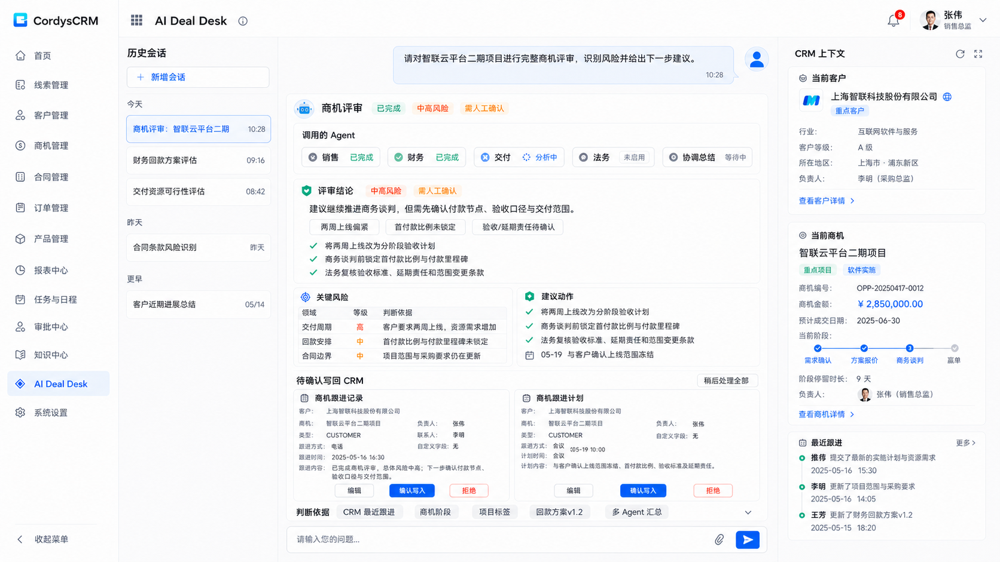
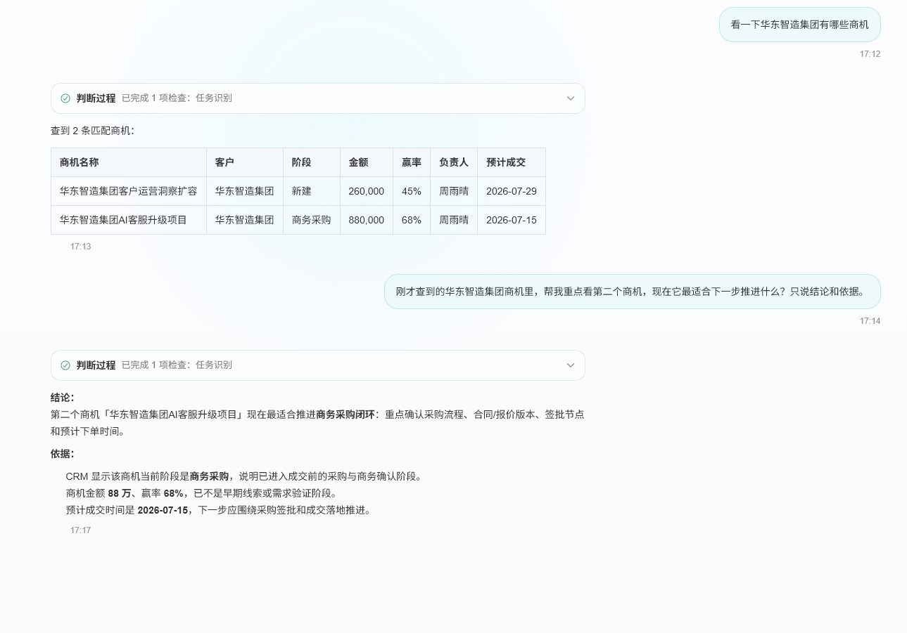
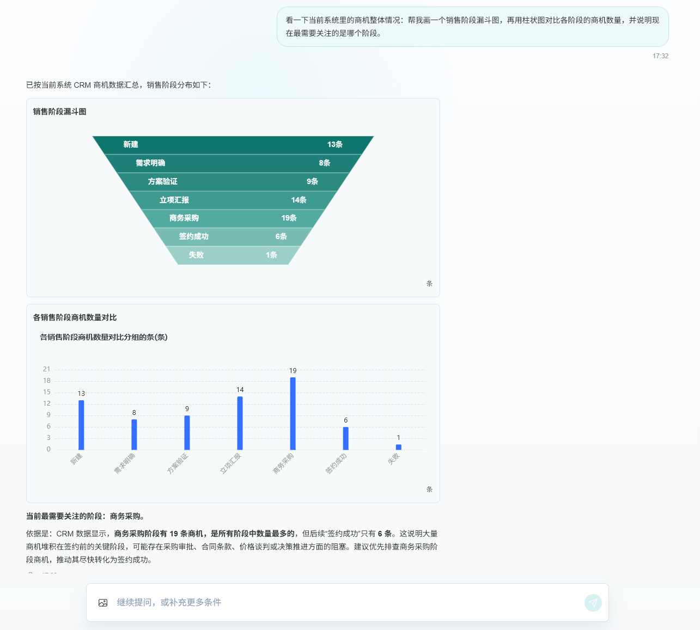
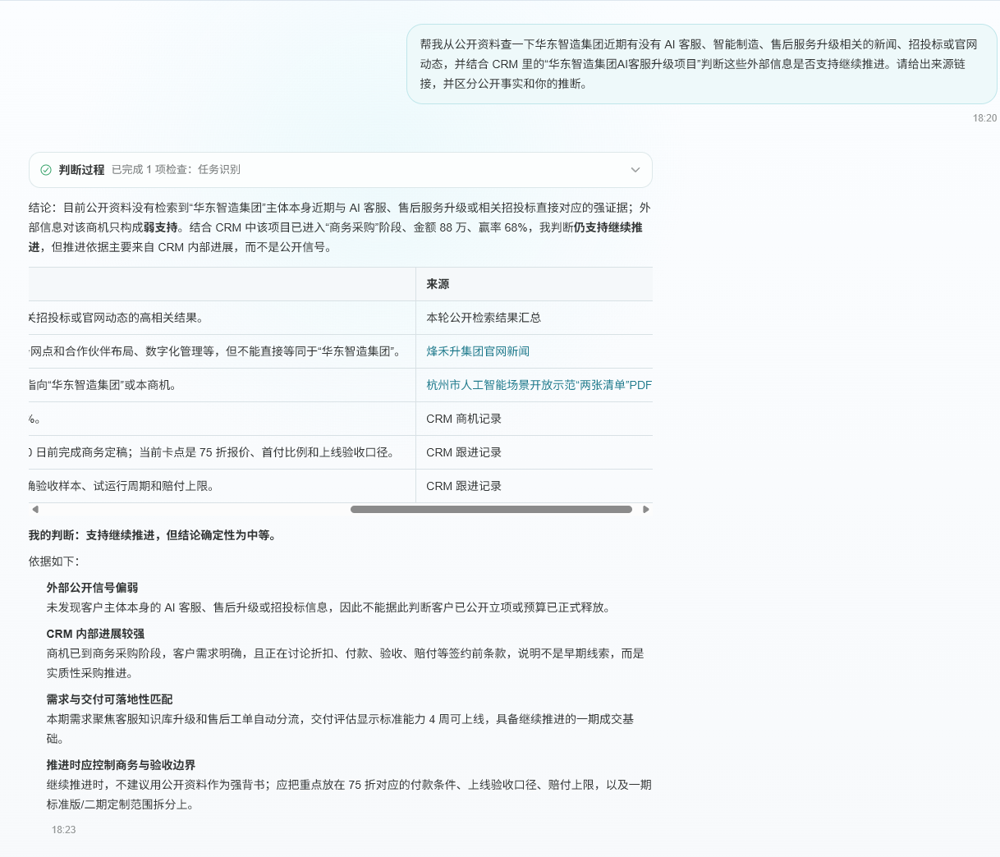
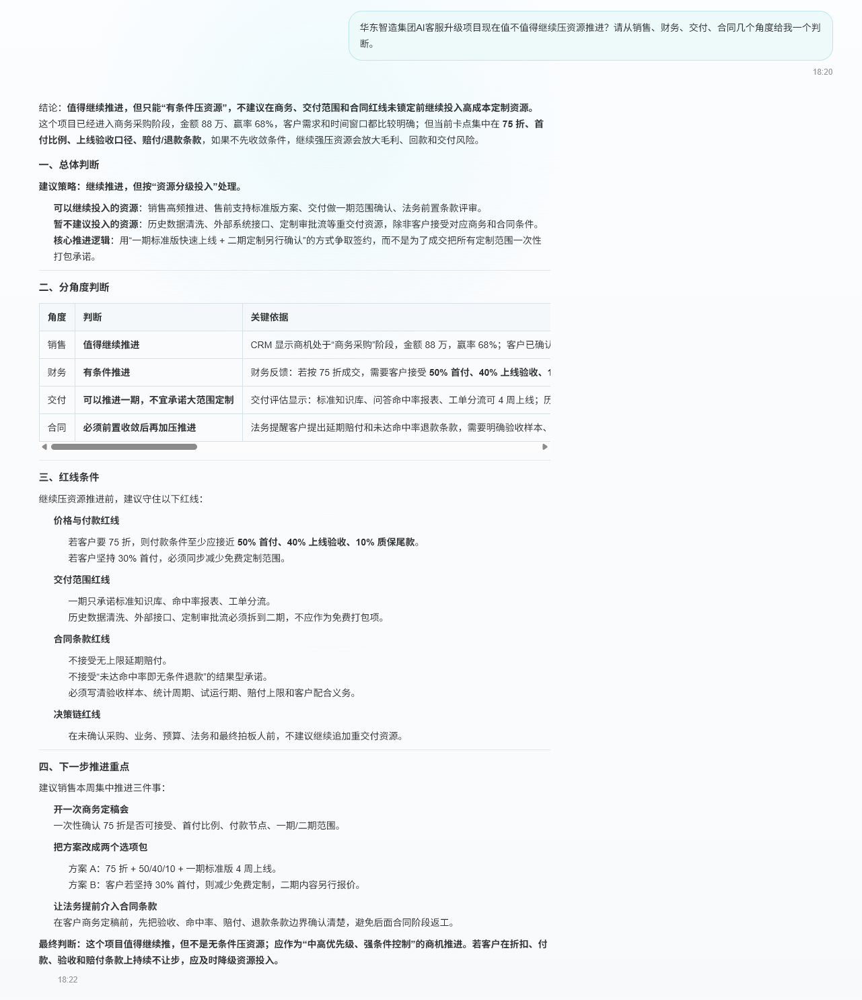
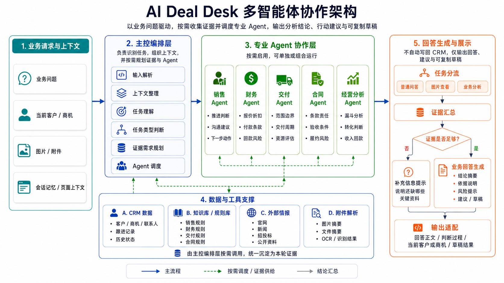
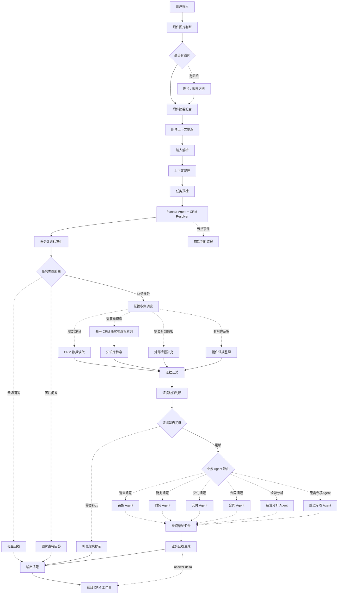

<h1 align="center">多Agent智能助手</h1>

<p align="center">
  <strong>AI Deal Desk for CRM</strong><br>
  嵌入 CRM 的多 Agent 商机协同工作台，帮助销售完成查询上下文、生成判断、输出建议与写回草稿的业务闭环。
</p>

<p align="center">
  
  
  
  
</p>

本项目基于 CordysCRM 开源 CRM 底座扩展，围绕销售真实工作流完成“识别业务对象、查询上下文、生成判断与建议、输出可执行草稿”的只读演示闭环。当前公开版已包含独立 AI 工作台、会话持久化、对象记忆、流式回答、节点过程展示和多 Agent 商机评审，重点展示 AI 产品设计、Agent 编排、CRM 工具协议和前端交互联动。

## 目标工作台

下图是面向作品集展示的目标工作台形态。当前公开版已经具备可运行工作台、Chatflow 模板、模拟数据和配套文档；图中的固定右侧业务栏与真实写回确认仍属于后续扩展方向。



## 项目亮点

| 亮点 | 说明 |
| --- | --- |
| CRM 内嵌体验 | AI 入口放在 CRM 工作流内，围绕客户、商机、联系人、跟进记录和计划等真实业务对象展开。 |
| 多 Agent 商机评审 | 将复杂商机拆成销售、财务、交付、合同等视角，再汇总成风险、结论和下一步动作建议。 |
| 证据驱动回答 | CRM 数据、知识库规则、附件摘要和外部情报按需进入判断链路，减少纯 Prompt 式空泛回答。 |
| 按需能力编排 | 根据任务动态启用 CRM、知识库、外部情报或专项 Agent，简单问题跳过非必要链路，减少无效调用和过度分析。 |
| 对象解析与上下文记忆 | Planner 可通过 CRM Resolver 校验客户或商机，并在连续对话中复用当前对象、切换对象和历史消息。 |
| 流式回答与过程可见 | 后端透传 Dify SSE，前端增量渲染最终回答，并将串行或并行节点事件映射为可展开的判断过程。 |
| 可核验公开来源 | 联网结果保留网页标题和原始链接，最终回答可生成行内引用及完整来源列表。 |
| 公开版可复用 | GitHub 版本已脱敏，不包含个人 API Key、真实域名和个人简历，便于导入、学习和二次改造。 |

## 🔥 功能介绍

- **支持 CRM 业务对象识别**：Planner Agent 可调用 `resolve_crm_object` 校验客户或商机，处理同名候选、客户与商机歧义及对话中的对象切换。
- **支持独立工作台与历史会话**：一级菜单进入 AI Deal Desk，右侧历史会话按日期分组，刷新后仍可恢复消息和当前业务对象。
- **支持真实流式输出**：后端透传 Dify SSE，前端按增量事件渲染文本，而不是等工作流结束后模拟逐字显示。
- **支持判断过程展示**：根据 Dify 节点事件实时展示已完成、运行中和并行处理状态，同时保留失败时的轻量降级映射。
- **支持文件上传**：支持上传图片或截图作为本轮对话证据，Chatflow 会将附件摘要纳入业务判断上下文。
- **支持前端 Markdown 渲染**：AI 回答支持标题、列表、表格、代码块、重点加粗、可点击来源链接和复制交互。
- **支持可视化图表输出**：经营分析类回答可通过 Markdown `chart` 代码块输出图表数据，由前端渲染为可视化图表。
- **支持多 Agent 商机评审**：复杂商机可按销售、财务、交付、合同 4 个视角分别分析，再统一汇总结论、风险和下一步建议。
- **支持知识库规则检索**：Planner 语义判断是否检索，并结合 CRM 事实整理检索词；折扣付款、交付范围、合同验收、销售推进等规则可作为判断证据。
- **支持外部情报补充**：当问题需要公开资料佐证时按需联网，保留网页标题、原始链接和证据边界。
- **支持数据写入草稿**：当前公开版默认不直接写入 CRM；当用户提出保存、写入或创建跟进计划时，会生成可复制的跟进记录/计划草稿，并保留后续接入真实写回的协议边界。
- **支持连续追问与对象切换**：短追问可复用当前客户或商机；用户显式提到其他对象时，Planner 会重新解析并切换上下文。

## 效果预览

以下截图基于演示数据，用于展示 CRM 内嵌式 AI 工作台的核心交互效果。

<table>
  <tr>
    <td width="50%">
      <strong>CRM 查询与连续追问</strong><br>
      <sub>通过自然语言查询客户/商机；对象不唯一时用候选列表澄清，后续追问可复用当前会话上下文。</sub><br><br>
      
    </td>
    <td width="50%">
      <strong>可视化图表输出</strong><br>
      <sub>经营分析类问题可输出漏斗图、柱状图等可视化结果，帮助快速识别重点阶段和转化瓶颈。</sub><br><br>
      
    </td>
  </tr>
  <tr>
    <td width="50%">
      <strong>外部情报与 CRM 证据结合</strong><br>
      <sub>外部公开资料作为辅助证据进入判断链路，并与 CRM 内部事实区分展示。</sub><br><br>
      
    </td>
    <td width="50%">
      <strong>复杂商机多 Agent 评审</strong><br>
      <sub>围绕销售、财务、交付、合同等视角进行专项判断，汇总成结论、风险边界和下一步建议。</sub><br><br>
      
    </td>
  </tr>
</table>

## 协作架构



## Chatflow 流程

实线表示稳定主流程，虚线表示按需触发的证据收集或专业 Agent 调度。
当前 Chatflow 由 54 个节点、75 条边组成，通过对象解析、任务规划、证据调度和 Agent Router 按需启用不同能力；简单问题可跳过知识检索、外部情报或专项 Agent 等非必要链路。



## 核心能力

- 客户与商机查询：在 CRM 对话入口中选择客户、商机，读取客户画像、联系人、跟进记录、计划和商机阶段。
- 商机进展总结：基于 CRM 已有记录生成当前进展、风险点和下一步建议。
- 沟通内容生成：生成面向客户的邮件、微信、跟进话术等草稿。
- 跟进计划生成：给出下一步动作、负责人、时间建议，并生成可复制草稿；真实写回作为后续阶段能力。
- 复杂商机评审：从销售、财务、交付、合同 4 个视角进行多 Agent 分析，汇总结论、风险和行动建议。
- 外部公开信息查询：按需联网，区分 CRM 事实、公开资料与模型推断，并回显可点击来源。
- 经营分析与图表：基于 CRM 聚合数据输出可读结论，并在有真实对比数据时生成图表。

## 目录结构

```text
CordysCRM/        CRM 前后端源码与 AI Deal Desk 扩展
chatflows/        Dify Chatflow 模板，已脱敏
demo-data/        演示数据 SQL
docs/             PRD、协议、Agent/Chatflow 设计、验收文档
knowledge-base/   AI Deal Desk 业务规则知识库
scripts/          本地启动、数据导入、冒烟测试脚本
tests/            Chatflow 与接口测试脚本
```

## Chatflow 配置

`chatflows/ai-deal-desk-v3.example.yml` 是公开模板，不包含个人 API Key。导入 Dify 后需要自行配置：

- 模型供应商 API Key
- `CRM_TOOL_BASE_URL`
- `DIFY_TOOL_TOKEN`
- 知识库数据集、Embedding 与 Rerank 模型
- `docs/reference/dify/AI Deal Desk CRM Resolver.openapi.yml` 对应的自定义工具，并将 `resolve_crm_object` 绑定给 Planner Agent

本地调试 Dify Cloud 时，`CRM_TOOL_BASE_URL` 需要是可公网访问的 HTTPS 地址，例如自己的 ngrok、cloudflared 或云服务器域名。

## 本地启动

在 Windows 环境下，可参考：

```powershell
powershell -ExecutionPolicy Bypass -File scripts\start-local-deal-desk.ps1
```

启动后访问：

```text
http://localhost:8081/#/login
http://localhost:8081/#/ai-deal-desk/index
```

演示账号和数据库初始化方式请参考 `docs/11-本地启动与联调经验.md` 与 `demo-data/`。

## 验证

仓库提供了 Chatflow 结构检查、Python 节点冒烟测试、前端事件适配测试和后端单元测试。导入或修改 Chatflow 后，可先运行：

```powershell
python tests\ai-deal-desk\validate-v3-chatflow.py
node scripts\ai-deal-desk-v3-readonly-topology.smoke-test.mjs
node scripts\ai-deal-desk-v3-python-codeblocks.smoke-test.mjs
node scripts\ai-deal-desk-v3-stats.smoke-test.mjs
```

## 安全说明

本仓库只保留演示代码、模板配置、模拟数据和项目文档。真实部署时请不要把以下内容提交到 GitHub：

- `.env`、真实 API Key、Dify App Key、模型供应商 Key
- 真实服务器域名、个人 ngrok 域名、真实数据库密码
- MySQL/Redis 运行时数据目录
- 日志、构建产物、个人简历和本地临时文件

## 项目定位

这个项目重点展示 AI 产品设计与工程闭环能力，而不是重做 CRM 基础业务。CordysCRM 作为业务对象底座，多Agent智能助手负责在 CRM 内完成对象识别、上下文读取、多角色判断、建议生成和草稿输出。AI 只提供内部判断与草稿，涉及折扣、付款、交付、合同或真实 CRM 写回时，仍由相应业务负责人确认。
