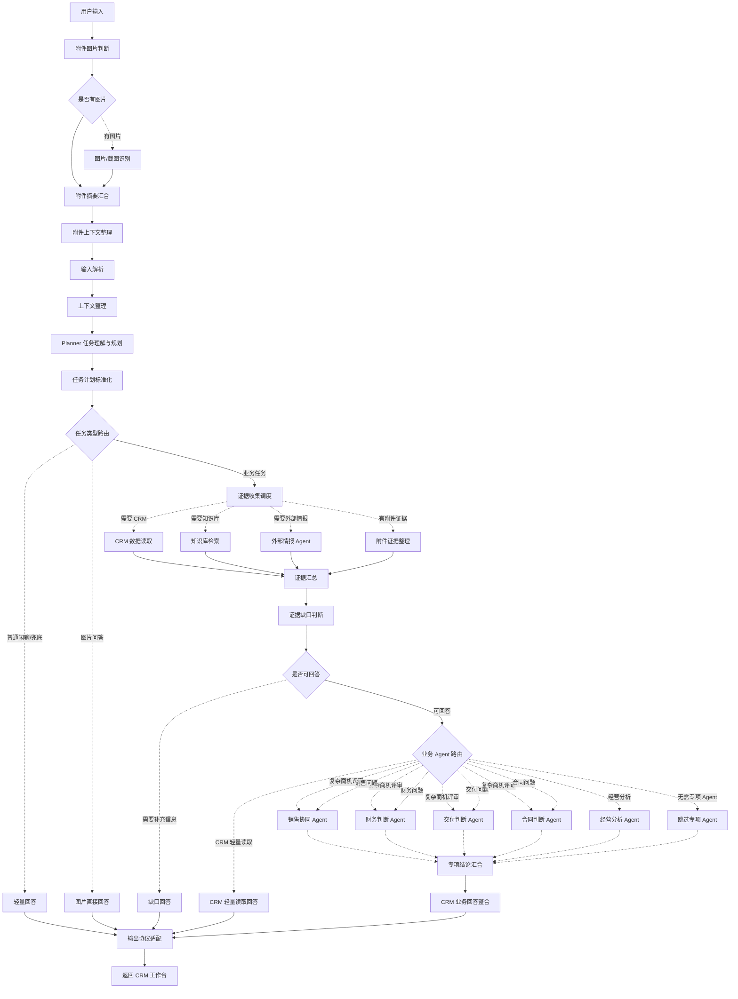

# Agent 与 Chatflow 设计

## 1. 文档目的

本文档是 多Agent智能助手 阶段 4 的主设计文档，用于固定 Planner 路由、多 Agent 分工、Dify Chatflow 编排、CRM Tool API 只读调用链路、多结果文本澄清、会话记忆和最终输出协议边界。

阶段 4 的目标不是重新设计 CordysCRM，也不是重开阶段 3 的 Tool API 合同，而是让当前 `chatflows/ai-deal-desk-v3.example.yml` 成为只读型 CRM 多智能体工作台：

```text
用户自由提问
  -> Planner 判断任务类型、目标对象、所需证据和回答目标
  -> 按需读取 CRM、知识库、外部情报和附件证据
  -> 按需进入销售、财务、交付、合同或经营分析 Agent
  -> CRM 业务回答生成
  -> 输出 DealDeskChatflowPayload
```

阶段 4 只负责 Dify Chatflow 设计和改造边界。当前 V3 暂不做 CRM 写回；输出协议中的 `writeback` 字段保留为空对象 `{}`，用于兼容前端协议。

## 2. 设计原则

- Planner 自主判断任务，不把所有问题套进固定评审流程。
- CRM 数据必须来自 Tool API 或前端已确认对象，不编造客户、商机、联系人、跟进记录和跟进计划。
- 对象不唯一时返回 Markdown 候选列表并提示用户输入完整客户名或商机名继续，不输出候选卡片，也不允许 Agent 猜测。
- 专项 Agent 只在问题需要对应视角时启用，多 Agent 评审只在复杂商机问题或用户明确要求评审时触发。
- 当前 V3 不调用 CRM 写入接口；用户要求保存或写入时，只生成可复制内容或跟进建议。
- Chatflow 不生成用户可见的判断过程文案；判断过程仍由后端基于 Dify SSE 节点状态映射。
- Chatflow 不向用户展示节点名、Prompt、工具调用、内部路由、JSON 代码块或调试信息。

## 2.1 V3 Stable Enhanced 当前主流程

当前 Chatflow 以 `chatflows/ai-deal-desk-v3.example.yml` 为准。它已经从旧版 `route_gate -> 各任务分支 -> 各自 answer` 的结构，改为“统一 Planner、统一证据台账、统一业务回答、统一协议适配”的链路。

稳定主干是：

```text
用户输入
  -> 附件图片判断与摘要汇合
  -> 输入解析
  -> 上下文整理
  -> Planner 任务理解与规划
  -> 任务计划标准化
  -> 任务类型路由
  -> 证据收集调度
  -> 证据汇总
  -> 证据完整度判断
  -> 业务 Agent 路由
  -> 专项结论汇合
  -> CRM 业务回答整合
  -> 输出协议适配
  -> 返回 CRM 工作台
```

当前流转关系如下。实线表示稳定主流程，虚线表示条件触发或按需执行：



外部情报、知识库、图片/附件和 CRM 工具都是证据来源；销售、财务、交付、合同、经营分析 Agent 是按需运行的领域判断角色。最终输出仍保持前端协议字段：

```text
protocolVersion / turnType / answerText / processEvents / writeback / boundObject
```

其中 `writeback` 保留为空对象用于兼容前端协议，当前不调用 CRM 写入接口。

## 3. 主 Agent 路由策略

主 Agent 先抽取以下关键信息：

| 信息 | 说明 |
| --- | --- |
| `task_intent` | 用户任务意图，如轻量问答、CRM 查询、商机总结、专项分析、复杂评审、内容生成 |
| `object_keyword` | 用户提到但尚未确认的客户或商机关键词 |
| `bound_object_*` | 前端通过 `@`、路由或会话记忆传入的当前业务对象 |
| `resume_query` | 兼容字段；P0 不依赖候选卡续跑，用户可直接输入完整客户名或商机名继续 |
| `requested_output` | 用户希望得到的输出形态，如分析结论、沟通话术、跟进计划草稿或评审摘要 |
| `evidence_requirements` | 本轮回答需要的 CRM、知识库、外部情报、附件或图片证据 |

路由优先级：

1. 如果是图片直答问题，优先基于图片/附件摘要回答。
2. 如果是泛销售管理、多Agent智能助手 概念解释或非 CRM 问题，走轻量回答。
3. 如果本轮或历史会话已经有唯一对象，优先使用当前会话记忆中的对象继续回答。
4. 如果问题需要 CRM 数据但对象未确认，先调用搜索工具确认客户或商机。
5. 如果用户要求保存、写入、记一条跟进，当前只生成可复制草稿，不执行 CRM 写入。
6. 如果问题只涉及单一专项视角，进入对应专项 Agent。
7. 如果用户明确要求评审，或问题同时涉及销售、财务、交付、合同中多个视角，进入多 Agent 评审。

当前任务与路由映射：

| 用户意图 | `task_type` | 主要路径 | CRM / 知识库 / Agent 行为 | 原始 `turnType` |
| --- | --- | --- | --- |
| 多Agent智能助手 概念、泛销售问题 | `general_chat` | 轻量回答 | 不查 CRM，不启用专项 Agent | `quick_answer` |
| 图片/截图内容问答 | `image_answer` | 图片直接回答 | 只基于附件摘要回答 | `quick_answer` |
| 查客户、查商机、列商机 | `object_query` | CRM 轻量读取 | 调 CRM；不启用专项 Agent | `object_select`，后端/前端按文本分析降级展示 |
| 总结客户或商机进展 | `progress_summary` | 业务 Agent 路由 | 调 CRM；启用销售协同 Agent | `text_analysis` |
| 生成话术、跟进摘要 | `sales_assist` / `content_draft` | 业务 Agent 路由 | 视对象调 CRM；启用销售协同 Agent | `text_analysis` |
| 生成跟进计划草稿 | `followup_plan` | 业务 Agent 路由 | 视对象调 CRM；启用销售协同 Agent | `text_analysis` |
| 付款、折扣、账期、回款 | `finance_check` | 业务 Agent 路由 | 调 CRM 和知识库；启用财务判断 Agent | `text_analysis` |
| 上线周期、定制范围、资源、验收 | `delivery_check` | 业务 Agent 路由 | 调 CRM 和知识库；启用交付判断 Agent | `text_analysis` |
| 合同条款、验收、赔付、责任边界 | `legal_check` | 业务 Agent 路由 | 调 CRM 和知识库；启用合同判断 Agent | `text_analysis` |
| 折扣、付款、交付、合同都看一下 | `full_review` | 业务 Agent 路由 | 调 CRM 和知识库；并行启用销售、财务、交付、合同 Agent | `deep_deal_review_brief`，页面按分析类展示 |
| 漏斗、转化、收入、回款统计 | `stats_analysis` | 业务 Agent 路由 | 调 CRM 统计工具；启用经营分析 Agent | `stats_query`，页面按分析类展示 |
| 外部行业或客户情报 | `external_research` | 业务 Agent 路由 | 按需启用外部情报 Agent，并由销售协同 Agent 成文 | `text_analysis` |
| 保存、写入、创建跟进计划 | `followup_plan` 或 `content_draft` | 草稿回答 | 当前只生成可复制草稿，不执行写回 | `text_analysis` |

## 4. CRM 工具调用链路

阶段 4 使用 Dify HTTP Request 节点调用 CordysCRM Tool API。工具地址、鉴权和运行环境配置由 Dify 环境变量或后端适配层管理，不在 DSL 中硬编码密钥。

P0 查询工具：

```text
POST /ai/deal-desk/tools/search-customers
POST /ai/deal-desk/tools/search-opportunities
POST /ai/deal-desk/tools/get-customer-context
POST /ai/deal-desk/tools/get-opportunity-context
```

当前暂停的写回工具：

```text
POST /ai/deal-desk/tools/create-follow-record
POST /ai/deal-desk/tools/create-follow-plan
```

当前 V3 只读版不在 Chatflow 中调用上述写回工具。同一组查询工具也可使用 `/front/ai/deal-desk/tools/*` 路径，具体以当前 Dify 到 CordysCRM 后端的网络配置为准。

### 4.1 客户查询

适用问法：

- `帮我查一下华东智造集团`
- `这个客户最近有什么跟进`
- `华东智造集团现在谁负责`

链路：

```text
参数抽取
  -> search-customers
  -> OK: 绑定客户或读取客户上下文
  -> OBJECT_AMBIGUOUS: 用 Markdown 列表展示候选，并提示输入完整客户名
  -> OBJECT_NOT_FOUND: 返回可恢复提示
```

如果客户唯一且用户只是查询客户基础信息，可直接基于搜索结果回答；如果用户要求总结、风险或下一步建议，应继续调用 `get-customer-context`。

### 4.2 商机查询

适用问法：

- `智造集团有哪些商机？`
- `帮我看一下云平台二期这个商机`
- `总结一下这个商机最近进展`

链路：

```text
参数抽取
  -> search-opportunities
  -> OK: 绑定商机
  -> 需要上下文: get-opportunity-context
  -> OBJECT_AMBIGUOUS: 用 Markdown 列表展示候选，并提示输入完整商机名
  -> OBJECT_NOT_FOUND: 返回可恢复提示
```

`get-opportunity-context` 是多 Agent 分析的主要上下文入口。专项 Agent 不应各自重复查询 CRM，应消费同一份标准上下文包。

## 5. 多结果文本澄清与会话对象复用

对象来源优先级：

1. 用户本轮通过 `@客户` 或 `@商机` 明确绑定的对象。
2. 当前会话记忆中的 `boundObject`。
3. 页面路由带入的 `route_customer_id` 或 `route_opportunity_id`。
4. Chatflow 从文本中抽取出的对象关键词。

当搜索工具返回 `OBJECT_AMBIGUOUS` 时，当前 Chatflow 原始 payload 可能仍使用 `turnType = object_select` 表达对象澄清语义，但不再输出 `objectSelect` 候选卡协议。后端适配层应将它归一为分析类文本展示，前端只消费 `answerText` 中的 Markdown 候选列表，并提示用户输入完整客户名或商机名继续。

```markdown
我查到多个匹配对象，请直接输入完整名称继续：

- **华东智造集团 - AI 客服升级项目**：阶段 方案评审，金额 880000，负责人 周雨晴
- **华东智造集团 - 数据中台二期**：阶段 商务沟通，金额 520000，负责人 张伟
```

规则：

- 候选对象必须来自 Tool API 返回值，不允许本地构造。
- 多结果只负责澄清范围，不进入最终评审、生成写回预览或假装已经绑定对象。
- 用户下一轮输入完整客户名或商机名后，Chatflow 重新搜索并在唯一命中时写入 `boundObject`。
- 用户说“这个商机”“这个客户”等连续对话表达时，优先沿用当前会话记忆中的唯一对象。
- 如果唯一对象是商机，应优先调用 `get-opportunity-context`；如果唯一对象是客户，应按任务需要调用 `get-customer-context` 或继续搜索该客户下商机。

## 6. 多 Agent 分工

V3 只读版保留以下 Agent 角色：

| Agent | 启用条件 | 输入 | 输出边界 |
| --- | --- | --- | --- |
| Planner | 每轮必经 | 用户问题、页面对象、会话状态、附件摘要 | 只做任务规划、对象识别和能力选择，不生成最终回答 |
| 轻量回答 Agent | 非 CRM 或泛销售问题 | 用户问题 | 不声称查询 CRM |
| 图片理解 Agent | 图片直答问题 | 图片/截图识别摘要 | 只基于可见内容回答，不扩展成业务评审 |
| 销售协同 Agent | 销售推进、进展总结、话术、跟进计划 | 证据台账、回答目标 | 输出推进判断和行动建议 |
| 财务判断 Agent | 付款、折扣、账期、回款风险 | 证据台账、规则知识 | 不输出财务已通过 |
| 交付判断 Agent | 上线周期、资源、定制范围、验收风险 | 证据台账、规则知识 | 不承诺资源或上线日期 |
| 合同判断 Agent | 条款、验收、赔付、责任边界 | 证据台账、规则知识 | 不给最终法律意见 |
| 经营分析 Agent | 漏斗、转化、收入、回款统计 | CRM 统计证据、回答目标 | 输出管理视角解读和建议 |
| CRM 业务回答生成 Agent | CRM 业务任务最终成文 | Planner、证据台账、领域结论 | 统一生成回答、判断、建议、草稿或下一步动作 |

分析类输出深度要求：

- 简单 CRM 查询只输出简洁 Markdown 列表或摘要，不强制长篇分析。
- 商机总结、专项风险判断和多 Agent 评审必须给出高价值 Markdown 长文本，覆盖结论、CRM 已确认事实、核心风险、风险影响、缺失信息、下一步动作和复核角色。
- 回答必须区分“CRM 已确认事实”“基于规则或上下文的风险推断”“当前缺失且不能断言的信息”。
- 知识库规则只能用于解释风险判断，不能替代 CRM 事实；例如缺少 `paymentTerms` 时，只能说付款条件或首付比例待确认，不能断言首付款比例偏低。
- 表格只在列表、对比、行动计划等确实更清晰时使用，不作为所有回答的固定模板。

多 Agent 评审触发条件：

- 用户明确使用“评审、复核、综合判断、多Agent智能助手”等表达。
- 用户同时要求折扣、付款、交付、合同等多个维度。
- 问题涉及成交方案取舍、重大风险或跨角色冲突。

不触发多 Agent 的场景：

- 单纯查询客户或商机。
- 单一付款、交付或合同问题。
- 只要求生成一段话术或跟进文本。
- 普通 多Agent智能助手 概念解释。

## 7. 写回能力（当前暂停）

当前 V3 只读版不实现写回确认链路，也不调用 `create-follow-record` 或 `create-follow-plan`。如果用户要求“保存、写入 CRM、记一条跟进”，Chatflow 只生成可复制的跟进记录、跟进计划或沟通草稿，并明确说明当前版本不会执行写入。

以下内容仅作为后续恢复写回能力时的历史参考，不作为当前 YML 实现依据。

写回只在用户明确表达以下意图时触发：

- 保存为跟进记录。
- 写入 CRM。
- 创建跟进计划。
- 把刚才结论保存。
- 生成并保存下一步计划。

写回确认链路：

```text
显式写回请求
  -> 确认当前客户或商机唯一
  -> 生成 writeback payload
  -> 返回 writeback_confirm
  -> 用户确认
  -> 调用 create-follow-record 或 create-follow-plan
  -> 返回 writeback_result
```

写回前必须满足：

- 当前客户或商机唯一。
- 写回类型属于 P0 白名单：跟进记录或跟进计划。
- `answerText` 展示完整待写入内容。
- `writeback` payload 包含目标对象、草稿内容和等待确认状态。
- 用户确认前不得调用写回工具。

用户确认后：

- `follow_record` 调用 `create-follow-record`。
- `follow_plan` 调用 `create-follow-plan`。
- `follow_record_and_plan` 分别调用两个工具，并分别处理成功和失败。
- 写回请求必须带 `idempotencyKey`，避免重复创建。

禁止写回：

- 审批通过。
- 正式报价承诺。
- 合同可签结论。
- 财务已通过结论。
- 商机阶段、金额、折扣等高风险字段更新。

## 8. 输出协议

Chatflow 最终输出继续对齐 `docs/06-多Agent智能助手 Chatflow 与前端协议规范.md`：

```ts
interface DealDeskChatflowPayload {
  protocolVersion: '1.0';
  turnType:
    | 'quick_answer'
    | 'object_select'
    | 'text_analysis'
    | 'deep_deal_review_brief'
    | 'stats_query'
    | 'writeback_confirm'
    | 'writeback_result'
    | 'fallback'
    | 'failed';
  answerText: string;
  writeback?: DealDeskWritebackPayload;
  boundObject?: DealDeskBoundObjectPayload;
  warnings?: string[];
}
```

阶段 4 不新增前端必填字段。若后续 DSL 改造发现协议必须变化，应先更新 `docs/06`，再改前端或后端适配层。

当前 V3 只读版保留 `writeback_confirm` 和 `writeback_result` 作为前端协议兼容类型，但 Chatflow 不主动产出这两个 `turnType`；显式写回类问法会降级为 `text_analysis` 草稿回答。`object_select`、`deep_deal_review_brief`、`stats_query` 是当前 DSL 的原始业务类型，页面展示上仍按文本分析类处理，不应新增用户可见的内部标签。

## 9. 异常与恢复

| 场景 | Chatflow 行为 |
| --- | --- |
| `OBJECT_AMBIGUOUS` | 原始 payload 可为 `object_select`，后端/前端按分析类文本展示，用 Markdown 列表展示候选并提示输入完整名称 |
| `OBJECT_NOT_FOUND` | 说明未找到，提示补充关键词或切换对象 |
| `INVALID_ARGUMENT` | 说明缺少必要信息，要求用户补充 |
| `PERMISSION_DENIED` | 说明当前账号无权访问该对象 |
| `CRM_READ_FAILED` | 说明 CRM 读取失败，可稍后重试 |
| 上下文缺少关键字段 | 给出有限判断，并说明不确定性 |
| 部分专项 Agent 失败 | 输出已完成视角，并说明缺失视角影响 |
| 用户要求写入 CRM | 生成可复制草稿，并说明当前版本不会执行写入 |
| 用户确认上一轮写回 | 说明当前 V3 只读版没有待执行写回链路 |

异常输出不得暴露内部节点、接口栈、Prompt、token、模型供应商或原始敏感响应。

## 10. DSL 改造顺序

阶段 4 后续实施按以下顺序推进：

1. 保留对前端稳定的最终协议字段，内部节点可以按只读多 Agent 协作协议重组。
2. 将主路由升级为 Planner，输出任务类型、回答目标、证据需求、所需 Agent 和成功标准。
3. 将 CRM、知识库、外部情报、图片/附件统一沉淀为证据台账，避免各节点直接争夺最终回答职责。
4. 将销售、财务、交付、合同、经营分析 Agent 限定为领域判断角色，统一交给 CRM 业务回答生成 Agent 成文。
5. 移除当前 YML 的写回执行链路，协议适配层固定输出 `writeback: {}`。
6. 增加拓扑与协议 smoke test，检查断边、重复节点、旧写回节点残留和关键只读链路。
7. 用 `docs/10-实施路线与验收清单.md` 的自由问法验收集逐条验证。

## 11. 阶段 4 完成标准

阶段 4 完成时应满足：

- `docs/09-Agent 与 Chatflow 设计.md` 成为 Agent 和 Chatflow 改造主依据。
- 当前 `chatflows/ai-deal-desk-v3.example.yml` 的 CRM 查询候选不再依赖本地 mock。
- 客户和商机查询通过 CordysCRM Tool API 完成。
- 多候选对象必须以 Markdown 列表澄清，不猜测、不生成候选卡片。
- 商机上下文通过标准上下文包分发给专项 Agent。
- 复杂评审可按销售、财务、交付、合同四视角分析，并由 CRM 业务回答生成 Agent 汇总为深度 Markdown 业务判断。
- 显式写回请求只生成可复制草稿，不调用真实写回工具。
- Chatflow 最终输出仍符合 `DealDeskChatflowPayload`。
- 用户可用自由问法完成轻量回答、CRM 查询、总结、专项判断、多 Agent 评审和内容生成。
