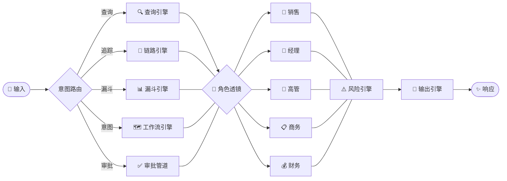
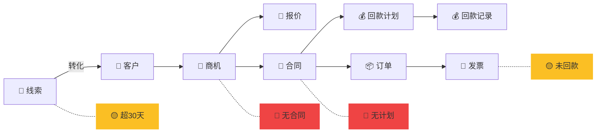

# Cordys CRM Skill

<p align="center">
  <br/>
  <em><strong>你的专属 AI 助手，告别在传统页面上点来点去</strong></em>
  <br/>
  <em>角色感知 &nbsp;·&nbsp; 管道原生 &nbsp;·&nbsp; 默认零信任</em>
  <br/><br/>
</p>

---

## 同一个 CRM，不同的人看到不同的世界

同一个系统。同一份数据。同一个问题：*"看看线索"*

销售听到的是**待办优先级**。经理看到的是**团队健康仪表盘**。财务得到的是**资金回笼全景**。

Cordys CRM Skill 不是给 CRM 加一层界面，而是加一层**智能**——它理解*谁*在问、*卡在* L2C 链路的哪个环节。它说人话，跨模块推理，在你开口问之前就告诉你哪里不对劲。

> **一行配置。** 填好 API 密钥，系统自动识别你的身份、匹配角色、激活对应的认知视角。不用搭仪表盘，不用存筛选器。

---

## 五个角色，五种视角

不是偏好设置。是系统在"展示什么、先展示什么、以什么紧迫度展示"这三个维度上的本质切换。

<table>
<tr>
<td width="20%" valign="top">

### 销售
```
关注： 我接下来该做什么？
范围： 我的客户/线索/商机
预警： 超期未跟、商机卡顿
输出： 优先级行动清单
```
</td>
<td width="20%" valign="top">

### 经理
```
关注： 谁需要我关注？
范围： 全部门 + 子团队
预警： 跟进率低、转化骤降
输出： 团队看板 → 下钻到人
```
</td>
<td width="20%" valign="top">

### 高管
```
关注： 公司能交多少？
范围： 全公司
预警： 目标缺口、部门偏离
输出： 趋势 → 对比 → 预测
```
</td>
<td width="20%" valign="top">

### 商务
```
关注： 合同签对了没有？
范围： 合同 + 审批流
预警： 到期未续、审批卡顿
输出： 合同状态 + 到期预警
```
</td>
<td width="20%" valign="top">

### 财务
```
关注： 钱在哪？
范围： 合同 → 回款 → 发票
预警： 逾期、未开票、链断裂
输出： 应收全景 → 催收排序
```
</td>
</tr>
</table>

---

## 架构

不是一个巨型提示词。是七个目标明确的**引擎晶格**，按需加载，通过共享上下文总线协同工作。



**核心原则**：`role-engine.md` 是唯一启动必加载的引擎（约 150 行）。其余全部按意图懒加载——保持上下文窗口精瘦。

---

## 七引擎晶格

| 引擎 | 激活信号 | 职责 |
|------|---------|------|
| **角色** | 会话启动 | 身份识别、角色匹配、人格绑定 |
| **CLI 规范** | 任何查询 | 自然语言 → `cordys.sh crm` 语义翻译 |
| **CLI 参考** | 复杂筛选条件 | 字段类型 → 操作符速查表 |
| **输出** | 每次响应 | JSON → 人类可读、角色自适应格式化 |
| **风险** | 数据展示后 | 单模块异常 + 跨模块链断裂检测 |
| **链路** | "查这笔单子" / "360视图" | L2C 正向追溯 / 反向溯源 |
| **漏斗** | "管道怎么样" / "转化率" | 多模块聚合、快照与趋势 |
| **工作流** | "今天做什么" | 模糊意图 → 结构化工作流 |

---

## L2C 管道 —— 从线索到现金，一气贯通

线索 → 客户 → 商机 → 报价 → 合同 → 订单 → 回款计划 → 回款记录 → 发票



每一个环节转换都是**可能的断裂点**。系统监控整条链路，在问题变成事故之前主动暴露——不只是单模块内，而是跨 L2C 全局。

### 链断裂检测示例

| 断裂场景 | 检测方式 | 严重度 |
|---------|---------|--------|
| 线索创建 > 30 天未转化 | 查线索无关联客户 | 🟡 警告 |
| 商机赢单 > 15 天无合同 | 赢单商机 vs 合同模块交叉比对 | 🔴 严重 |
| 合同签约无回款计划 | 合同 vs 回款计划交叉比对 | 🔴 严重 |
| 已开发票 > 90 天未回款 | 发票 vs 回款记录交叉比对 | 🔴 严重 |
| 客户 > 180 天无跟进 | 客户跟进记录时间交叉检查 | 🟡 警告 |

---

## 实际体验

### 销售 —— 晨会速览

```
> 今天有什么要跟的？

📋 今日跟进计划（3 项）
| 客户 | 内容 | 优先级 |
| YYY集团 | 确认需求 | 🚨 超期5天 |
| 华星科技 | 发送报价 | ⚠️ 今日到期 |
| ABC技术 | 初次联系 | 🟢 新线索 |

📊 我的管线：线索12 / 商机4（¥52万） / 签约1（¥12万）
💡 商机"XX项目"在需求确认阶段停留10天，建议推进
```

### 经理 —— 周会看板

```
> 团队这周怎么样？

📊 团队 L2C 漏斗（本周）
| 成员 | 新增线索 | 新增商机 | 签约 | 签约额 |
| 张三 | 8 | 2 | 1 | ¥12万 |
| 李四 | 5 | 1 | 0 ⚠️ | ¥0 |
| 王五 | 12 | 4 | 2 | ¥35万 🏆 |

🚨 李四本周签约为零，跟进率 40% < 团队均值 68%
📋 2 条待审批超过 3 天未处理
💡 建议 1v1 了解李四管线卡点
```

### 财务 —— 应收全景

```
> 欠款情况

💰 应收账款全景
汇总：总应收 ¥285万 | 已逾期 ¥45万 🚨 | 7天内到期 ¥62万 ⚠️

🚨 逾期回款（3 笔）
| 合同 | 客户 | 逾期 | 金额 |
| CRM-001 | 华星 | 15天 | ¥15万 |
| CRM-008 | 远航 | 32天 | ¥20万 |
| CRM-012 | 星辰 | 8天 | ¥10万 |

⚠️ 链断裂：2份签约合同未创建回款计划（¥55万）
```

---

## 安全姿态

| 原则 | 实现 |
|------|------|
| **默认零信任** | API 请求仅发往已配置的 `CORDYS_CRM_DOMAIN` |
| **凭证隔离** | 密钥存 `.env`，永不进版本控制，永不出现于输出 |
| **非信任域拦截** | 跨域请求默认拒绝，除非显式设 `CORDYS_ALLOW_UNTRUSTED=1` |
| **输出脱敏** | Access Key / Secret Key 在所有可见输出中自动剥离 |
| **最小权限兜底** | 角色匹配失败时降级为 `sales`（最受限视角） |

---

## 快速开始

```bash
# Clawdhub 安装（推荐）
clawdhub install cordys-crm

# 手动安装
git clone --branch main https://github.com/1Panel-dev/CordysCRM-skills \
  ~/.openclaw/workspace/skills/CordysCRM-skills
mv ~/.openclaw/workspace/skills/CordysCRM-skills/skills \
  ~/.openclaw/workspace/skills/cordys-crm
rm -rf ~/.openclaw/workspace/skills/CordysCRM-skills
```

```bash
# 配置
vi ~/.openclaw/workspace/skills/cordys-crm/.env

# .env 内容
CORDYS_ACCESS_KEY=***
CORDYS_SECRET_KEY=***
CORDYS_CRM_DOMAIN=https://你的域名

# 可选：自定义角色映射
# ROLE_MAP=VP|总监=sales-manager,会计|出纳=finance
```

就这三行。零上手成本。

---

## 仓库结构

```
skills/
├── SKILL.md                  # 入口编排
├── registry.json             # 技能清单（v1.1.0）
├── .env                      # API 凭证（不入库）
├── Cordys.md                 # 运行时身份缓存（不入库）
│
├── core/                     # 引擎晶格
│   ├── role-engine.md        # 🧠 身份 → 人格绑定
│   ├── cli-spec.md           # ⚙️ 自然语言 → cordys.sh 语义翻译
│   ├── cli-reference.md      # 📖 字段类型 → 操作符速查
│   ├── output-engine.md      # 🧾 JSON → 人类可读格式化
│   ├── risk-engine.md        # ⚠️ 异常检测（单模块 + 跨模块链断裂）
│   ├── linkage-engine.md     # 🔗 L2C 正向追溯 / 反向溯源
│   ├── funnel-engine.md      # 📊 管道聚合与预测
│   └── workflow-engine.md    # 🗺️ 意图 → 工作流匹配
│
├── profiles/                 # 人格定义
│   ├── sales.md              # 销售：行动优先，个人视角
│   ├── sales-manager.md      # 经理：排名优先，下钻分析
│   ├── executive.md          # 高管：趋势优先，公司全景
│   ├── contract-admin.md     # 商务：合规优先，合同全生命周期
│   └── finance.md            # 财务：资金流优先，链路完整
│
├── scripts/
│   ├── cordys.sh             # Shell CLI（主力）
│   └── cordys.py             # Python CLI（仅兼容备用）
│
└── references/
    └── crm-api.md            # API 接口文档 + L2C 链路说明
```

---

## 设计思路

> **不是数据浏览器，是智能层。**

- **角色变形**：不问你是谁，自己判断。在说出第一个字之前，输出已经适配了你的角色。
- **管道原生**：L2C 不是"功能模块"，是系统的脊柱。每一次查询、每一次预警、每一条工作流，都锚定在这条链上。
- **引擎晶格**：七个精小引擎，各司其职。用到才加载，用不到不浪费注意力。
- **先于提问的预警**：风险检测是主动的。系统主动告诉你你没注意到的，而不是等你来问。
- **无头设计**：一个轻量 CLI（`cordys.sh`）调用 REST API。无 UI 依赖，可嵌入任何环境。

