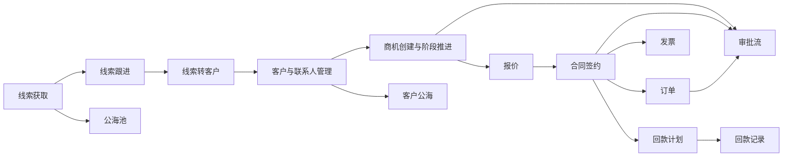
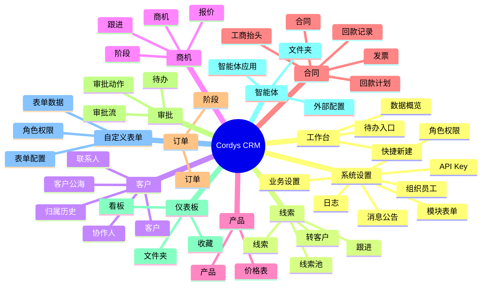

# Cordys CRM v1.7.1 原系统 PRD

版本：v1.7.1  
整理时间：2026-06-15  
整理范围：基于当前项目源码、路由、后端 Controller、模块表单配置和 README 反向整理。  
重要说明：本文只描述 Cordys CRM 原系统当前版本能力，不包含后续 多Agent智能助手、多 Agent 工作台或任何二次改造方案。

## 1. 产品概述

Cordys CRM 是一套面向企业销售团队的开源 CRM 系统，目标是支撑从线索到回款的 L2C 全流程管理。

系统覆盖线索获取、线索池管理、客户与联系人管理、商机推进、报价、合同、回款计划、回款记录、发票、订单、审批、BI 仪表板、智能体接入、组织权限与系统配置等能力。

## 2. 产品定位

### 2.1 产品目标

- 建立企业销售过程中的客户、线索、商机、合同、回款等核心数据资产。
- 支撑销售团队从线索获取到合同签约、订单履约、回款跟踪的闭环协作。
- 通过权限、审批、表单配置、视图配置和日志能力，满足企业内部管控需求。
- 通过 BI、SQLBot、DataEase、MaxKB、MCP 等集成能力，支持数据分析和智能化应用接入。

### 2.2 目标用户

- 销售人员：维护线索、客户、联系人、商机、跟进记录和跟进计划。
- 销售主管：查看团队销售数据，分配线索/客户，管理商机阶段和销售过程。
- 商务/合同人员：维护报价、合同、工商抬头、发票、回款计划和回款记录。
- 财务人员：跟踪回款计划、回款记录、发票和合同金额。
- 管理员：维护组织、用户、角色、权限、模块、表单、审批流、消息和系统集成配置。
- 管理层：通过首页与仪表板查看销售经营数据和过程指标。

### 2.3 核心业务流程

## 3. 功能范围

### 3.1 首页 / 工作台

入口：`/workbench`

#### 功能目标

为用户提供日常 CRM 工作入口和销售数据概览。

#### 主要能力

- 快捷新建：
  - 客户
  - 联系人
  - 线索
  - 商机
  - 合同
  - 发票
  - 跟进记录
  - 跟进计划
  - 订单
- 数据概览：
  - 今日、本周、本月、本年相关销售指标
  - 跟进、商机、赢单、金额等指标卡片
- 个人待办入口：
  - 跟进计划
  - 通知消息
  - 审批待办

## 4. 线索管理

入口：`/leadManagement`

### 4.1 线索

#### 业务目标

管理潜在客户信息，并通过跟进、状态更新和转化动作进入客户池或正式客户流程。

#### 核心字段

- 公司名称
- 线索进度
- 线索来源
- 线上来源详情
- 客户需求
- 联系人名称
- 联系人电话
- 意向产品
- 地区
- 负责人

#### 功能需求

- 支持线索新增、编辑、详情查看、删除。
- 支持线索分页列表、筛选、排序、视图切换。
- 支持线索状态更新。
- 支持线索跟进记录、跟进计划。
- 支持线索转客户。
- 支持线索批量转移、批量更新、批量删除、批量进入线索池。
- 支持线索导入、导出、导出选中。
- 支持线索图表统计。

### 4.2 线索池

#### 业务目标

沉淀未被销售个人持有或需要重新分配的线索，实现统一回收、领取和分配。

#### 功能需求

- 支持线索进入线索池。
- 支持池内线索列表和详情。
- 支持领取、分配、回收规则相关配置。
- 支持线索池视图配置。

## 5. 客户管理

入口：`/account`

### 5.1 客户

#### 业务目标

维护企业客户主数据，沉淀客户画像、联系人、跟进、商机、合同、回款等关联信息。

#### 核心字段

- 客户名称
- 客户行业
- 客户等级
- 客户类型
- 客户来源
- 线上来源详情
- 客户标签
- 地区
- 负责人

#### 功能需求

- 支持客户新增、编辑、详情查看、删除。
- 支持客户分页列表、筛选、排序、视图切换。
- 支持客户批量转移、批量更新、批量删除、批量进入公海。
- 支持客户导入、导出、导出选中。
- 支持客户合并。
- 支持客户图表统计。
- 支持客户详情页查看关联数据：
  - 联系人
  - 商机
  - 合同
  - 发票
  - 回款计划
  - 回款记录
  - 订单
  - 跟进记录
  - 跟进计划
- 支持客户协作人管理。
- 支持客户归属历史查看。

### 5.2 联系人

#### 核心字段

- 客户名称
- 姓名
- 邮箱
- 手机号
- 负责人

#### 功能需求

- 支持联系人新增、编辑、详情、删除。
- 支持按客户关联联系人。
- 支持联系人启用/停用。
- 支持联系人视图配置。

### 5.3 客户公海

#### 业务目标

管理未归属或被回收的客户资源，支持销售团队重新领取、分配和激活。

#### 功能需求

- 支持客户进入公海。
- 支持公海客户列表和详情。
- 支持公海容量与回收规则。
- 支持公海视图配置。

## 6. 商机管理

入口：`/opportunity`

### 6.1 商机

#### 业务目标

管理从客户需求到签约前的销售机会，支撑阶段推进、金额预测、赢率判断、报价和跟进。

#### 核心字段

- 商机名称
- 客户名称
- 业务编码
- 商机来源
- 金额
- 意向产品
- 结束时间
- 可能性
- 联系人
- 客户标签
- 备注信息
- 地区
- 负责人

#### 商机阶段

系统支持阶段配置，默认阶段包括：

- 新建
- 需求明确
- 方案验证
- 立项汇报
- 商务采购
- 成功
- 失败

#### 功能需求

- 支持商机新增、编辑、详情查看、删除。
- 支持商机分页列表、筛选、排序、视图切换。
- 支持商机阶段推进。
- 支持商机看板/阶段配置。
- 支持商机跟进记录和跟进计划。
- 支持商机关联客户、联系人和产品。
- 支持商机图表统计。

### 6.2 报价

#### 业务目标

基于商机输出报价单，维护报价产品、金额和有效期。

#### 核心字段

- 报价名称
- 商机
- 联系人
- 报价日期
- 有效期至
- 报价产品
- 累计金额

#### 功能需求

- 支持报价新增、编辑、详情查看、删除。
- 支持报价下载/导出。
- 支持报价作废。
- 支持报价产品明细和金额计算。

## 7. 产品与价格表

入口：`/product`

### 7.1 产品

#### 业务目标

维护可销售产品主数据，为线索、商机、报价、合同、订单提供产品引用。

#### 核心字段

- 产品名称
- 产品价格
- 状态
- 描述
- 产品图片

#### 功能需求

- 支持产品新增、导入、编辑、删除。
- 支持产品上下架状态管理。
- 支持产品图片维护。
- 支持产品列表搜索、分页和排序。

### 7.2 价格表

#### 业务目标

维护不同产品组合或销售策略下的价格表。

#### 核心字段

- 价格表名称
- 状态
- 产品信息
- 备注

#### 功能需求

- 支持价格表新增、编辑、删除。
- 支持价格表启用/停用。
- 支持价格表产品明细维护。

## 8. 合同与回款

入口：`/contract`

### 8.1 合同

#### 业务目标

管理客户签约后的合同信息、合同阶段、产品报价和合同金额。

#### 核心字段

- 合同名称
- 客户名称
- 合同编号
- 合同报价信息
- 负责人
- 合同开始时间
- 合同结束时间
- 累计金额

#### 功能需求

- 支持合同新增、编辑、详情查看、删除。
- 支持合同阶段管理。
- 支持合同关联客户和产品报价。
- 支持合同金额自动汇总。
- 支持合同审批。

### 8.2 回款计划

#### 核心字段

- 回款计划名称
- 合同
- 负责人
- 计划回款金额
- 计划回款时间

#### 功能需求

- 支持回款计划新增、编辑、详情、删除。
- 支持按合同查看回款计划。
- 支持回款计划统计。

### 8.3 回款记录

#### 核心字段

- 回款记录名称
- 回款编码
- 合同名称
- 回款计划
- 负责人
- 回款时间
- 回款金额
- 收款银行
- 收款银行账号

#### 功能需求

- 支持回款记录新增、编辑、详情、删除。
- 支持回款记录关联合同和回款计划。
- 支持回款金额统计。

### 8.4 工商抬头

#### 业务目标

维护客户开票和合同相关的工商抬头信息。

#### 功能需求

- 支持工商抬头配置和维护。
- 支持发票模块引用工商抬头。

### 8.5 发票

#### 核心字段

- 发票名称
- 合同名称
- 开票类型
- 开票项目名称
- 规格型号
- 单位
- 数量
- 税率
- 工商抬头
- 发票金额
- 负责人

#### 功能需求

- 支持发票新增、编辑、详情、删除。
- 支持发票关联合同和工商抬头。
- 支持开票金额、税率等开票信息维护。

## 9. 订单管理

入口：`/order`

#### 业务目标

管理合同或客户关联的销售订单，记录销售产品和收货信息。

#### 核心字段

- 订单编号
- 关联客户
- 关联合同
- 订单名称
- 负责人
- 产品明细
- 订单金额
- 收货地址
- 收货人
- 收货人联系方式

#### 功能需求

- 支持订单新增、编辑、详情、删除。
- 支持订单阶段管理。
- 支持订单关联客户和合同。
- 支持订单产品明细与金额计算。
- 支持订单导出。

## 10. 跟进管理

### 10.1 跟进记录

#### 业务目标

记录销售人员与线索、客户、商机相关的实际沟通过程。

#### 核心字段

- 跟进类型
- 客户名称 / 公司名称
- 商机
- 联系人
- 跟进方式
- 跟进时间
- 负责人
- 意向产品
- 跟进内容

#### 功能需求

- 支持跟进记录新增、编辑、详情、删除。
- 支持从客户、线索、商机详情页创建。
- 支持按客户、线索、商机查看历史记录。

### 10.2 跟进计划

#### 业务目标

管理未来待执行的客户、线索、商机沟通计划。

#### 核心字段

- 跟进类型
- 客户名称 / 公司名称
- 商机
- 联系人
- 预计开始时间
- 跟进方式
- 负责人
- 意向产品
- 预计沟通内容

#### 功能需求

- 支持跟进计划新增、编辑、详情、删除。
- 支持取消计划。
- 支持计划状态更新。
- 支持计划转为跟进记录。

## 11. 仪表板与 BI

入口：`/dashboard`

#### 业务目标

提供销售数据可视化看板，帮助管理层和销售主管分析经营表现。

#### 功能需求

- 支持仪表板新增、编辑、重命名、删除。
- 支持仪表板收藏和取消收藏。
- 支持仪表板分页列表和收藏列表。
- 支持仪表板模块树管理：
  - 新增文件夹
  - 重命名文件夹
  - 删除文件夹
  - 拖拽移动
  - 统计数量
- 支持通过全屏路由查看仪表板。
- 支持与 DataEase / SQLBot 类能力集成，用于数据分析和智能问数。

## 12. 智能体

入口：`/agent`

#### 业务目标

在 CRM 内管理可用智能体应用，并与外部智能体平台进行集成。

#### 功能需求

- 支持智能体新增、编辑、重命名、删除。
- 支持智能体列表、详情、收藏、取消收藏、收藏列表。
- 支持智能体文件夹树：
  - 新增文件夹
  - 重命名
  - 删除
  - 移动
  - 数量统计
- 支持检查外部智能体配置连接。
- 支持获取用户工作空间和智能体应用。
- 支持获取智能体脚本信息。
- 支持获取智能体版本和应用配置。

#### 集成说明

当前源码中智能体模块与 MaxKB 类外部智能体平台配置相关；系统同时提供 `/mcp/form/config/{formKey}` 用于获取 CRM 表单字段配置，供外部工具理解 CRM 表单结构。

## 13. 标讯

入口：`/tender`

#### 业务目标

集成外部标讯应用，为销售团队提供招投标信息入口。

#### 功能需求

- 支持获取标讯应用配置。
- 支持基于权限访问标讯入口。

## 14. 自定义表单

入口：`/customForm`

#### 业务目标

支持企业按自身业务需求配置自定义表单和表单数据。

#### 功能需求

- 支持自定义表单创建、编辑、删除和列表。
- 支持自定义表单数据新增、编辑、删除、详情和分页。
- 支持自定义表单角色权限配置。
- 支持字段类型配置、表单联动、子表、公式、数据源、附件、图片等字段能力。

## 15. 审批流

入口：系统设置 / 审批流

#### 业务目标

为合同、订单、报价等业务对象提供审批流程和状态权限管控。

#### 功能需求

- 支持审批流新增、编辑、删除、启用。
- 支持按表单类型配置审批流。
- 支持审批节点、审批人、条件分支和 Webhook 测试。
- 支持发起审批、撤回审批。
- 支持审批动作：
  - 同意
  - 驳回
  - 撤回
  - 转交
  - 加签
  - 抄送
- 支持审批任务列表：
  - 待审批
  - 已处理
  - 我发起的
  - 抄送我的
- 支持待审批数量统计。

## 16. 搜索与视图

#### 业务目标

提升跨模块查找效率，并支持用户按业务习惯配置个人视图和搜索字段。

#### 功能需求

- 支持全局搜索：
  - 客户
  - 联系人
  - 线索
  - 线索池
  - 客户池
  - 商机
- 支持高级搜索。
- 支持搜索字段脱敏配置。
- 支持用户搜索配置。
- 支持各业务模块的用户视图配置：
  - 新增视图
  - 编辑视图
  - 删除视图
  - 固定视图
  - 拖拽排序
  - 启用视图

## 17. 系统设置

入口：`/system`

### 17.1 组织与员工

#### 功能需求

- 支持组织、部门、员工管理。
- 支持员工新增、编辑、详情、删除。
- 支持批量启用、批量编辑、批量重置密码。
- 支持员工导入、模板下载、导入预检查。
- 支持员工同步检查和三方同步。

### 17.2 角色与权限

#### 功能需求

- 支持角色新增、编辑、删除、详情。
- 支持角色权限设置。
- 支持角色数据范围配置。
- 支持角色关联用户。
- 支持按部门树、用户树配置角色成员。

### 17.3 模块与表单配置

#### 功能需求

- 支持模块启用/禁用与配置。
- 支持模块表单字段配置。
- 支持字段显示、字段来源、重复校验、业务字段解析。
- 支持字段类型：
  - 文本
  - 数字
  - 日期
  - 单选/多选
  - 成员
  - 部门
  - 地区
  - 数据源
  - 子表
  - 公式
  - 图片
  - 附件

### 17.4 消息与公告

#### 功能需求

- 支持消息任务配置。
- 支持公告管理。
- 支持站内通知列表、最近通知、最近公告、已读、全部已读、消息数量统计。
- 支持 SSE 实时消息订阅。

### 17.5 业务设置

#### 功能需求

- 支持页面设置。
- 支持第三方集成配置。
- 支持邮件设置、邮件测试。
- 支持 DataEase Token、组织同步等配置。

### 17.6 日志与审计

#### 功能需求

- 支持登录日志。
- 支持操作日志。
- 支持导出任务中心。
- 支持附件、图片上传与预览。

### 17.7 API Key 与 MCP

#### 功能需求

- 支持用户 API Key 创建、查询、更新、删除、启用、停用和校验。
- 支持通过 MCP 表单配置接口获取业务表单字段结构。

## 18. 权限与数据范围

### 18.1 权限模型

系统采用基于角色的权限模型，不同菜单、页面和接口通过权限标识控制访问。

权限类型覆盖：

- 读取
- 新增
- 编辑
- 删除
- 导入
- 导出
- 下载
- 作废
- 阶段推进
- 回款
- 审批

### 18.2 数据范围

角色支持不同数据范围，用于控制用户可查看和操作的数据边界：

- 全部数据权限
- 指定部门权限
- 本部门数据权限
- 本部门及以下数据权限
- 仅本人数据

## 19. 导入导出

系统支持多个模块的导入、导出能力：

- 线索导入/导出
- 客户导入/导出
- 员工导入
- 报价下载/导出
- 订单导出
- 导出任务中心

导入流程通常包括：

1. 下载模板
2. 上传文件
3. 预检查
4. 正式导入

## 20. 非功能需求

### 20.1 部署

- 支持 Docker 部署。
- 默认服务端口：
  - Web / 后端：`8081`
  - README 中描述 MCP Server 端口：`8082`
- 依赖 MySQL 和 Redis。
- 支持私有化部署。

### 20.2 国际化

- 前端和后端存在 i18n 资源。
- 支持中文与英文文案配置。

### 20.3 安全

- 支持登录认证。
- 支持 CSRF Token。
- 支持 API Key。
- 支持基于角色的菜单和接口权限。
- 支持数据范围控制。
- 支持操作日志和登录日志。

### 20.4 可配置性

- 支持模块开关。
- 支持表单字段配置。
- 支持审批流配置。
- 支持视图配置。
- 支持消息和第三方集成配置。

## 21. 当前版本边界

以下内容属于当前源码可见能力或 README 描述能力，但需要按部署方式和配置状态确认实际可用性：

- DataEase / SQLBot / MaxKB / 标讯等第三方应用需要完成外部配置后才能正常使用。
- README 描述 Docker 方式暴露 `8082` MCP Server；本地源码运行链路下是否启动独立 MCP SSE 服务，需要以实际运行状态为准。
- 智能体模块用于管理和接入外部智能体应用，原系统并不包含面向特定业务场景的多 Agent 编排工作台。

## 22. 信息架构总览

## 23. 源码依据

本 PRD 主要依据以下源码信息整理：

- README：产品定位、L2C 流程、部署方式、技术栈、路线图。
- 前端路由：`frontend/packages/web/src/router/routes/modules/*`
- 菜单映射：`frontend/packages/web/src/config/pathMap.ts`
- 工作台快捷入口：`frontend/packages/web/src/config/workbench.ts`
- 后端 Controller：`backend/crm/src/main/java/cn/cordys/crm/**/controller/*Controller.java`
- 模块表单字段：`sys_module_form`、`sys_module_field` 当前数据库配置。
- 智能体与 MCP：`AgentController`、`AgentModuleController`、`McpController`。
