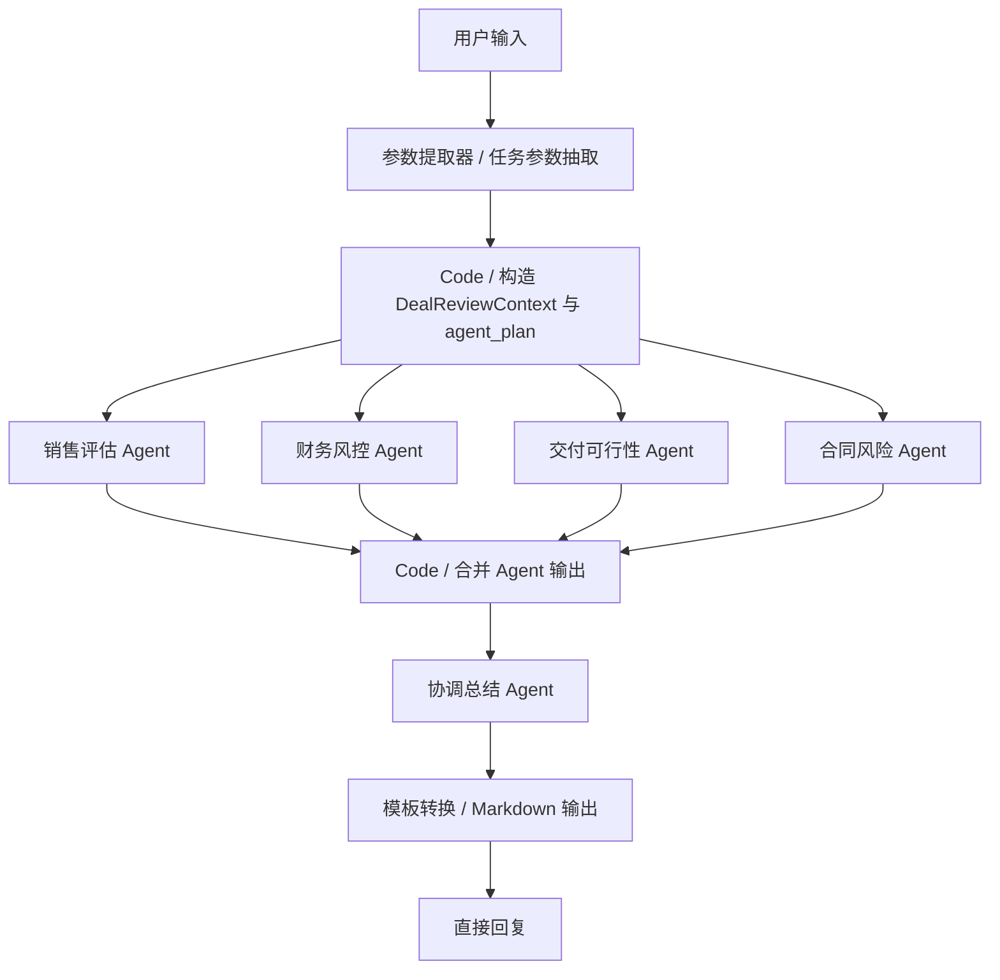
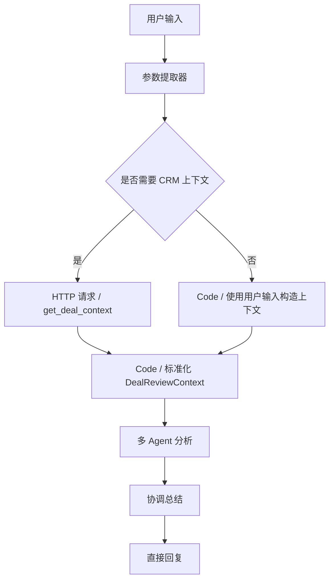

# Dify 平台节点与 DSL 说明

| 文档字段 | 内容 |
| --- | --- |
| 文档名称 | Dify 平台节点与 DSL 说明 |
| 所属项目 | 多Agent智能助手 |
| 文档版本 | v0.1 |
| 更新时间 | 2026-06-15 |
| 当前阶段 | Dify Chatflow 搭建准备 / DSL 生成参考 |
| 主要读者 | AI 应用开发、产品、后端开发、前端开发、测试、后续维护人员 |

## 1. 文档目的

本文档用于记录当前 Dify 平台在 `Chatflow` 模式下可用的节点、变量、功能开关和 DSL 文件结构，作为后续生成可导入 YAML 文件的参考。

本文档来源包括：

- 当前导出的 `ai deal desk.yml`
- 官方模板 `问题分类 + 知识库 + 聊天机器人.yml`
- 官方模板 `知识库 + 聊天机器人.yml`
- Dify Chatflow 编排界面截图
- Dify 功能面板截图
- Dify 会话变量、环境变量、系统变量截图
- Dify 官方节点文档

本文档不定义 多Agent智能助手 的业务需求。业务需求以以下文档为准：

- `01-项目方案说明.md`
- `02-Agent设计说明.md`
- `03-交互流程与输出设计.md`

---

## 2. 当前应用类型判断

当前导出的 DSL 顶部信息如下：

```yaml
app:
  mode: advanced-chat
kind: app
version: 0.6.0
```

结论：

| 字段 | 说明 |
| --- | --- |
| `mode: advanced-chat` | 当前应用为 Chatflow |
| `kind: app` | Dify 应用导出文件 |
| `version: 0.6.0` | 当前 DSL 结构版本 |

多Agent智能助手 应继续使用 `advanced-chat / Chatflow`，原因：

- 用户侧需要对话窗口。
- 底层需要工作流编排。
- Chatflow 使用 `Answer` 节点返回对话结果。
- Workflow 使用 `Output` 节点返回结果，不适合作为当前主要入口。

---

## 3. DSL 顶层结构

当前 `ai deal desk.yml` 的顶层结构为：

```yaml
app:
  description: ''
  icon: 🤖
  icon_background: '#FFEAD5'
  icon_type: emoji
  mode: advanced-chat
  name: ai deal desk
  use_icon_as_answer_icon: false
dependencies: []
kind: app
version: 0.6.0
workflow:
  conversation_variables: []
  environment_variables: []
  features:
  graph:
    edges:
    nodes:
    viewport:
  rag_pipeline_variables: []
```

### 3.1 app

用于定义应用基础信息。

| 字段 | 说明 |
| --- | --- |
| `name` | 应用名称 |
| `description` | 应用描述 |
| `mode` | 应用模式，当前为 `advanced-chat` |
| `icon` | 应用图标 |
| `icon_background` | 图标背景 |
| `use_icon_as_answer_icon` | 是否使用应用图标作为回答头像 |

### 3.2 workflow

用于定义 Chatflow 的运行配置。

| 字段 | 说明 |
| --- | --- |
| `conversation_variables` | 会话变量，跨多轮对话持久保存 |
| `environment_variables` | 环境变量，用于密钥、外部服务地址等配置 |
| `features` | Web App 用户体验功能开关 |
| `graph.nodes` | 画布节点列表 |
| `graph.edges` | 节点连线列表 |
| `graph.viewport` | 画布视图位置和缩放 |
| `rag_pipeline_variables` | RAG 管道变量，当前为空 |

---

## 4. 变量体系

### 4.1 用户输入变量

在 Chatflow 的开始节点中，界面显示可用输入字段：

| 变量 | 类型 | 说明 |
| --- | --- | --- |
| `userinput.query` | String | 用户当前输入文本 |
| `userinput.files` | Array[File] | 用户上传文件 |

当前导出的 LLM 节点中，默认记忆模板引用：

```text
{{#sys.query#}}

{{#sys.files#}}
```

说明：

- UI 中展示的是 `userinput.query` / `userinput.files`。
- 导出 DSL 中可能使用 `sys.query` / `sys.files` 作为默认引用。
- 后续生成 DSL 时应优先参考当前导出文件中的变量引用方式，避免手写时出现版本不兼容。

### 4.2 系统变量

截图中当前系统变量包括：

| 变量 | 类型 | 说明 |
| --- | --- | --- |
| `sys.conversation_id` | String | 会话 ID |
| `sys.dialog_count` | Number | 会话次数 |
| `sys.user_id` | String | 用户 ID |
| `sys.app_id` | String | 应用 ID |
| `sys.workflow_id` | String | 工作流 ID |
| `sys.workflow_run_id` | String | 工作流运行 ID |

用途：

- 日志追踪。
- 后端关联运行记录。
- 前端展示运行状态。
- 调试 Dify 运行链路。

### 4.3 会话变量

会话变量用于在 Chatflow 多轮对话中保存上下文。

截图中示例：

| 变量 | 类型 | 说明 |
| --- | --- | --- |
| `conversation_var` | String | 示例会话变量 |

使用规则：

- 会话变量存储在 `workflow.conversation_variables`。
- 会话变量可被 LLM 等节点读取。
- 会话变量可通过 `变量赋值 / assigner` 节点写入。
- 会话变量适合保存当前客户、当前商机、最近一次评审结果等跨轮上下文。

多Agent智能助手 建议会话变量：

| 变量 | 类型 | 用途 |
| --- | --- | --- |
| `current_customer_id` | String | 当前客户 ID |
| `current_customer_name` | String | 当前客户名称 |
| `current_opportunity_id` | String | 当前商机 ID |
| `current_opportunity_name` | String | 当前商机名称 |
| `last_task_type` | String | 上一次任务类型 |
| `last_review_summary` | String | 最近一次评审摘要 |

P0.1 阶段可以先不使用会话变量，优先保证单轮评审流程可运行。进入多轮上下文体验后再启用。

### 4.4 环境变量

环境变量用于配置敏感信息或环境差异信息。

截图说明：

- 环境变量适合保存 API 密钥、数据库密码等敏感信息。
- 环境变量可在工作流中使用，但不应直接写入代码。
- 不同环境可以共享同一工作流，但使用不同环境变量值。

多Agent智能助手 建议环境变量：

| 变量 | 用途 |
| --- | --- |
| `CRM_API_BASE_URL` | 多Agent智能助手 后端工具层地址 |
| `CRM_API_TOKEN` | 后端工具层访问令牌 |
| `DIFY_ENV` | 当前环境标识，例如 demo / dev |

注意：

- Dify Cloud 无法直接访问本地 `127.0.0.1`。
- 若 HTTP Request 节点要调用本地 Cordys CRM，需要公网地址或内网穿透。
- 不应把真实生产密钥写进 DSL 文件。

---

## 5. 功能开关

当前 DSL 中 `workflow.features` 包含以下能力。

### 5.1 文件上传

DSL 字段：

```yaml
features:
  file_upload:
    enabled: false
```

功能：

- 允许用户在对话中上传图片、文档或其他文件。
- 文件可进入文档提取器、视觉 LLM、HTTP 请求或其他工具节点。

多Agent智能助手 建议：

| 阶段 | 建议 |
| --- | --- |
| P0.1 | 关闭 |
| P0.2 | 可用于上传合同条款、报价单、客户需求文档 |
| P1 | 可结合文档提取器和合同风险 Agent |

### 5.2 开场白与问题建议

DSL 字段：

```yaml
opening_statement: ''
suggested_questions: []
suggested_questions_after_answer:
  enabled: false
```

功能：

- `opening_statement`：对话开始时展示欢迎语。
- `suggested_questions`：展示初始推荐问题。
- `suggested_questions_after_answer`：每次回答后自动生成后续问题建议。

多Agent智能助手 建议：

- P0.1 可以配置固定开场白和固定建议问题。
- 自动后续问题建议可暂时关闭，避免生成不可控动作。

建议问题示例：

- `查询华东智造集团最近商机`
- `总结当前商机推进情况`
- `评审 8 折、三期付款、两周上线方案`
- `生成下一步跟进计划`

### 5.3 引用和归属

DSL 字段：

```yaml
retriever_resource:
  enabled: true
```

功能：

- 展示知识库引用来源。
- 当回答使用知识库内容时，可显示引用片段或来源。

多Agent智能助手 建议：

- 保持开启。
- 对折扣规则、交付规则、合同风险规则的命中依据有帮助。
- SaaS 前端可以展示业务化依据，不展示模型原始思维链。

### 5.4 语音能力

DSL 字段：

```yaml
speech_to_text:
  enabled: false
text_to_speech:
  enabled: false
```

功能：

- `speech_to_text`：语音转文字输入。
- `text_to_speech`：文本转语音输出。

多Agent智能助手 建议：

- P0.1 关闭。
- 该项目主要展示 B 端业务流程，不需要语音能力。

### 5.5 内容审查

截图中功能面板包含“内容审查”。

功能：

- 对用户输入或模型输出进行安全过滤。
- 可使用审查 API 或关键词策略。

多Agent智能助手 建议：

- P0.1 可暂不启用。
- 若后续接入真实企业数据，可启用关键词审查和敏感信息拦截。

---

## 6. 当前 DSL 已覆盖节点

当前 `ai deal desk.yml` 中已出现以下节点类型：

| 节点名称 | DSL `data.type` | 主要用途 | 多Agent智能助手 建议 |
| --- | --- | --- | --- |
| 用户输入 | `start` | 接收用户输入和上传文件 | 必用 |
| LLM | `llm` | 调用模型生成、分析、总结 | 必用，子 Agent 主要用它实现 |
| 直接回复 | `answer` | Chatflow 中向用户返回结果 | 必用 |
| 知识检索 | `knowledge-retrieval` | 从知识库检索上下文 | P0.2 或 P1，P0.1 可先用 Prompt 内置规则 |
| Agent | `agent` | 让模型自主选择工具执行任务 | 谨慎使用，P0.1 不作为主子 Agent 实现 |
| 问题分类器 | `question-classifier` | 将用户问题分类并路由 | 可用于 L1/L2/L3 任务分类 |
| 条件分支 | `if-else` | 根据条件走不同分支 | 可用于判断是否进入复杂评审 |
| 人工介入 | `human-input` | 暂停流程等待人工输入 | P0.1 不用于 CRM 写回主链路 |
| 迭代 | `iteration` | 对数组逐项执行子流程 | 当前不需要 |
| 循环 | `loop` | 循环执行直到满足退出条件 | 当前不需要 |
| 代码执行 | `code` | 用 Python/JS 处理结构化数据 | 必用或强烈建议，用于解析 JSON、合并 Agent 输出 |
| 模板转换 | `template-transform` | 使用模板拼接文本 | 建议用于最终 Markdown 输出 |
| 变量聚合器 | `variable-aggregator` | 汇聚互斥分支输出 | 可用于分类分支合流，不用于并行 Agent 合并 |
| 文档提取器 | `document-extractor` | 提取上传文档文本 | P1 合同文件分析可用 |
| 变量赋值 | `assigner` | 写入会话变量 | P0.2 多轮上下文可用 |
| 参数提取器 | `parameter-extractor` | 从自然语言抽取结构化字段 | 强烈建议用于任务参数抽取 |
| HTTP 请求 | `http-request` | 调用外部 API | P0.2 接入 CRM 工具层时使用 |
| 列表操作 | `list-operator` | 过滤、排序、选择数组元素 | 文件处理或候选对象处理时可用 |

---

## 7. 关键节点说明

### 7.1 Start / 用户输入

用途：

- Chatflow 的起点。
- 接收用户自然语言输入。
- 可接收上传文件。

当前 DSL 示例：

```yaml
data:
  title: 用户输入
  type: start
  variables: []
```

多Agent智能助手 用法：

- P0.1 只依赖用户文本输入。
- 用户输入是任务识别、参数抽取和商机评审的主要来源。

### 7.2 LLM

用途：

- 调用大模型完成理解、分析、总结和生成。
- 可作为主控路由 Agent、销售评估 Agent、财务风控 Agent、交付可行性 Agent、合同风险 Agent、协调总结 Agent。

当前 DSL 示例：

```yaml
data:
  context:
    enabled: false
    variable_selector: []
  memory:
    query_prompt_template: '{{#sys.query#}}


      {{#sys.files#}}'
    window:
      enabled: false
      size: 10
  model:
    completion_params:
      temperature: 0.7
    mode: chat
    name: ''
    provider: ''
  prompt_template:
  - role: system
    text: ''
  title: LLM
  type: llm
```

多Agent智能助手 用法：

| 节点 | 建议实现 |
| --- | --- |
| 主控路由 Agent | LLM 或参数提取器 + Code |
| 销售评估 Agent | LLM |
| 财务风控 Agent | LLM |
| 交付可行性 Agent | LLM |
| 合同风险 Agent | LLM |
| 协调总结 Agent | LLM |

建议：

- 子 Agent 优先用 LLM 节点，不优先使用 Agent 节点。
- 每个 LLM 节点使用不同系统提示词。
- 每个子 Agent 输出结构化 JSON，便于后续汇总。

### 7.3 Answer / 直接回复

用途：

- Chatflow 中向用户输出最终结果。
- 可引用上游节点变量。

当前 DSL 示例：

```yaml
data:
  answer: '{{#llm.text#}}'
  title: 直接回复
  type: answer
```

注意：

- Chatflow 使用 `Answer` 节点。
- Workflow 使用 `Output` 节点。
- 多Agent智能助手 当前是 Chatflow，因此最终输出应使用 Answer。

### 7.4 Parameter Extractor / 参数提取器

用途：

- 从自然语言中抽取结构化参数。
- 适合把用户输入转成客户、商机、折扣、付款、上线周期、合同条款等字段。

官方文档说明该节点会将非结构化文本转成结构化数据，并输出抽取结果和状态变量，例如 `__is_success`、`__reason`。

本地模板 `知识库 + 聊天机器人.yml` 中的参数提取器节点示例：

```yaml
data:
  instruction: ''
  model:
    completion_params:
      temperature: 0.7
    mode: chat
    name: gpt-4o
    provider: langgenius/openai/openai
  parameters:
  - description: Dify的安装
    name: answer
    required: true
    type: string
  query:
  - '1711528917469'
  - text
  reasoning_mode: prompt
  title: 参数提取器
  type: parameter-extractor
```

已确认的 DSL 规则：

- `parameters` 用于定义要抽取的字段。
- 每个字段包含 `name`、`description`、`required`、`type`。
- `query` 用于指定输入变量，格式为 `[上游节点 ID, 变量名]`。
- 参数提取器可以抽取上游 LLM 的输出，也可以抽取用户输入或其他文本变量。
- 下游节点可通过 `{{#参数提取器节点ID.字段名#}}` 引用抽取结果。
- 状态变量以实际 Dify 版本和节点配置为准，生成 DSL 时不能只依赖状态变量完成主流程判断。

多Agent智能助手 建议抽取字段：

| 字段 | 类型 | 说明 |
| --- | --- | --- |
| `task_type` | string | query / summary / content_generation / deal_review / writeback |
| `customer_name` | string | 客户名称 |
| `opportunity_name` | string | 商机名称 |
| `discount` | string | 折扣 |
| `payment_terms` | string | 付款方式 |
| `delivery_timeline` | string | 上线周期 |
| `contract_terms` | string | 合同特殊条款 |

### 7.5 Question Classifier / 问题分类器

用途：

- 将用户输入分类并路由到不同分支。
- 适合判断用户任务属于查询、总结、内容生成、复杂评审还是写回确认。

注意：

- 问题分类器更适合“互斥分类”。
- 它不适合直接表达“同时启用财务、交付、合同多个子 Agent”。

多Agent智能助手 可用分类：

| 类别 | 说明 |
| --- | --- |
| `customer_or_deal_query` | 客户 / 商机查询 |
| `deal_summary` | 商机总结 |
| `content_generation` | 内容生成 |
| `deal_review` | 复杂商机评审 |
| `unclear` | 意图不明确，需要追问 |

### 7.6 If-Else / 条件分支

用途：

- 根据变量条件进入不同路径。
- 支持 IF / ELIF / ELSE。

当前 DSL 示例：

```yaml
data:
  cases:
  - case_id: 'true'
    conditions: []
    logical_operator: and
  title: 条件分支
  type: if-else
```

多Agent智能助手 用法：

- 判断是否进入复杂评审。
- 判断是否缺少商机。
- 判断是否生成写回草稿。
- 判断某个子 Agent 是否需要启用。

重要边界：

- `If-Else` 一次执行通常走一个匹配分支。
- 如果一个请求要同时启用多个子 Agent，不应只用一个 If-Else 做互斥分支。
- 多 Agent 场景应使用并行分支或让所有子 Agent 运行后各自判断是否适用。

### 7.7 Code / 代码执行

用途：

- 处理复杂数据转换。
- 解析 JSON。
- 合并多 Agent 输出。
- 生成统一前端响应结构。

官方文档说明 Code 节点支持 Python 或 JavaScript，函数需要返回字典。

多Agent智能助手 强烈建议使用场景：

| 场景 | 说明 |
| --- | --- |
| 解析主控路由 JSON | 防止 LLM 输出带 Markdown 或格式不稳定 |
| 生成 `agent_plan` | 根据抽取字段生成布尔计划 |
| 合并多 Agent 输出 | 将销售、财务、交付、合同结果合并 |
| 构造最终 Schema | 输出统一 JSON 供 Answer 节点展示 |

### 7.8 Template Transform / 模板转换

用途：

- 使用 Jinja2 模板把变量转换为结构化文本。
- 适合生成最终 Markdown 回答。

多Agent智能助手 用法：

- 将结构化评审结果转成可读 Markdown。
- 生成固定格式的风险摘要、推荐方案和下一步行动。
- 避免让最终 Answer 节点直接拼复杂文本。

### 7.9 Variable Aggregator / 变量聚合器

用途：

- 汇聚互斥分支中的同类输出。
- 减少重复下游节点。

重要边界：

- 官方文档明确它用于互斥分支。
- 不用于合并多个并行分支的输出。
- 如果要合并销售、财务、交付、合同多个 Agent 的结果，应使用 Code 或 Template 节点。

多Agent智能助手 用法：

- 可以汇聚“查询 / 总结 / 评审”互斥分支输出。
- 不建议用于多 Agent 并行输出合并。

### 7.10 HTTP Request / HTTP 请求

用途：

- 调用外部 API。
- 支持 URL、Header、Query、Body、认证、超时、重试。
- 可引用上游节点变量。

当前 DSL 示例：

```yaml
data:
  authorization:
    config: null
    type: no-auth
  body:
    data: []
    type: none
  method: get
  retry_config:
    max_retries: 3
    retry_enabled: true
    retry_interval: 100
  type: http-request
  url: ''
```

多Agent智能助手 用法：

| 工具 | 方法 | 用途 |
| --- | --- | --- |
| `search_crm_objects` | POST | 搜索客户、商机、联系人 |
| `get_deal_context` | POST | 获取商机完整上下文 |
| `validate_write_back_payload` | POST | 校验写回内容 |
| `create_follow_record` | POST | 创建跟进记录 |
| `create_follow_plan` | POST | 创建跟进计划 |

注意：

- Dify Cloud 不能直接访问本机 `127.0.0.1`。
- 后续需要公网可访问工具层或内网穿透。
- API Key 和 Token 应放环境变量，不写死在 DSL。

### 7.11 Knowledge Retrieval / 知识检索

用途：

- 从 Dify 知识库检索相关内容。
- 输出结果可作为 LLM 上下文。

多Agent智能助手 用法：

| 知识库 | 对应 Agent |
| --- | --- |
| 折扣与付款规则 | 财务风控 Agent |
| 交付规则 | 交付可行性 Agent |
| 合同风险规则 | 合同风险 Agent |
| 输出模板 | 协调总结 Agent |

P0.1 建议：

- 先不接知识库。
- 将最小业务规则写进 Prompt。
- 流程稳定后再拆成知识库。

### 7.12 Agent 节点

用途：

- 让模型自主决定是否调用工具。
- 适合开放式工具调用任务。

多Agent智能助手 建议：

- P0.1 不建议把销售、财务、交付、合同子 Agent 都做成 Agent 节点。
- 优先用 LLM 节点保证输出可控。
- 后续若某个子任务需要自主选工具，再局部使用 Agent 节点。

### 7.13 Human Input / 人工介入

用途：

- 暂停工作流，等待人工输入或确认。

多Agent智能助手 建议：

- 不作为 P0.1 正式 CRM 写回确认主链路。
- 写回确认应由 SaaS 前端和后端控制。
- 可用于 Dify WebApp 内部调试或辅助确认。

### 7.14 Iteration / 迭代

用途：

- 对数组逐项执行内部子流程。
- 可顺序或并行处理。

多Agent智能助手 当前不需要。

潜在场景：

- 批量评审多个商机。
- 批量处理多个合同条款。
- 批量生成多个跟进计划。

### 7.15 Loop / 循环

用途：

- 按条件重复执行，直到满足退出条件。

多Agent智能助手 当前不建议使用。

原因：

- 多Agent智能助手 评审流程应可控。
- 循环会增加调试和成本不可控风险。
- B 端业务流程更适合显式节点和人工确认。

### 7.16 Document Extractor / 文档提取器

用途：

- 将上传文档转成文本。

多Agent智能助手 潜在场景：

- 上传合同条款。
- 上传报价单。
- 上传客户需求文档。

P0.1 不需要。

### 7.17 List Operator / 列表操作

用途：

- 过滤、排序、选择数组元素。
- 可用于文件数组、候选对象数组或工具返回列表。

多Agent智能助手 潜在场景：

- 从多个候选商机中取 Top N。
- 从上传文件中筛选文档。
- 从工具返回记录中选择最新跟进记录。

---

## 8. 工具面板能力

截图中工具面板包含以下分类：

| 分类 | 说明 |
| --- | --- |
| 插件 | 第三方或官方插件工具 |
| 自定义 | 自定义工具 |
| 工作流 | 其他工作流作为工具 |
| MCP | MCP 工具 |
| 精选推荐 | Firecrawl、Jina AI、Tavily、JSON 处理、MinerU 等 |

多Agent智能助手 建议：

| 工具能力 | 当前建议 |
| --- | --- |
| HTTP Request | P0.2 接 CRM 工具层首选 |
| 自定义工具 | 可封装 CRM 查询和写回接口 |
| MCP | P0.2 / P1，要求 HTTP transport 且 Dify Cloud 可访问 |
| JSON 处理 | 可辅助处理结构化输出 |
| Firecrawl / Tavily / Jina | 当前项目不依赖 |
| 飞书工具 | 当前项目不依赖 |

### 8.1 Dify 工具市场参考

Dify Marketplace 当前提供多类插件能力，包括：

| 类型 | 说明 | 多Agent智能助手 相关性 |
| --- | --- | --- |
| Tools | 可作为工作流工具节点调用的外部服务能力 | 后续可参考，但 P0.1 不依赖 |
| Data Sources | 外部数据源连接能力 | 可用于企业知识、文档或数据库扩展 |
| Triggers | 外部事件触发工作流 | 当前不需要 |
| Agent Strategies | Agent 策略能力 | 后续如需更复杂 Agent 自主执行可评估 |
| Extensions / Bundles | 扩展和组合能力 | 当前不需要 |

当前项目对工具市场的使用原则：

- P0.1 不依赖工具市场插件，优先使用 LLM、Code、Template、Answer 等基础节点。
- P0.2 接入 CRM 时优先使用 `HTTP Request` 或自定义工具。
- 工具市场插件需要安装、授权和凭证配置，不能假设 DSL 导入后自动可用。
- 若使用 Marketplace 工具，DSL 中可能出现 `dependencies`，导入目标工作区需要具备对应插件。
- CRM 写回类能力不应直接交给第三方插件，应通过 多Agent智能助手 后端适配层做权限和字段白名单校验。

---

## 9. Dify 多 Agent 编排注意事项

### 9.1 Dify 中的“子 Agent”不是独立创建按钮

在 Chatflow 中，子 Agent 通常通过多个节点实现：

| 业务角色 | Dify 实现 |
| --- | --- |
| 主控路由 Agent | LLM / Parameter Extractor / Code |
| 销售评估 Agent | LLM 节点 |
| 财务风控 Agent | LLM 节点 |
| 交付可行性 Agent | LLM 节点 |
| 合同风险 Agent | LLM 节点 |
| 协调总结 Agent | LLM 节点 |

每个子 Agent 的差异来自：

- 节点名称。
- 系统 Prompt。
- 输入变量。
- 是否接知识库。
- 是否允许工具。
- 输出 Schema。

### 9.2 多 Agent 启用策略

多Agent智能助手 有一个特殊点：一次评审可能同时触发财务、交付、合同多个 Agent。

可选实现方式：

| 方案 | 说明 | 优点 | 风险 |
| --- | --- | --- | --- |
| 全量运行四个子 Agent | 每次复杂评审都跑销售、财务、交付、合同 | DSL 简单，效果稳定，便于演示 | 成本略高，部分 Agent 可能输出“不适用” |
| 多个并行 If-Else 分支 | 每个子 Agent 前各有一个启用判断 | 更贴近 `agent_plan` | DSL 更复杂，合并输出要用 Code |
| 单个 If-Else 互斥分支 | 根据任务类型走一个分支 | 简单 | 不适合同时启用多个子 Agent |

P0.1 推荐：

> 复杂评审时全量运行四个子 Agent，每个子 Agent 在 Prompt 中根据输入判断是否适用；若不适用，输出 `status: skipped`。

原因：

- 最容易导入成功。
- 最容易调试。
- 最符合“展示多 Agent 协作”的目标。
- 后续可优化为按 `agent_plan` 条件启用。

### 9.3 并行与合并

Dify 支持串行和并行节点。

重要规则：

- 串行节点可以读取前序节点变量。
- 并行分支不能互相读取对方变量。
- 并行分支汇聚后的下游节点可以读取所有分支输出。
- 变量聚合器适合互斥分支，不适合合并并行 Agent 输出。
- 并行 Agent 输出建议用 Code 或 Template 合并。

---

## 10. 多Agent智能助手 P0.1 推荐 Chatflow 结构

### 10.1 第一版无 CRM 接口结构

先搭建无 CRM API 的多 Agent 骨架：



### 10.2 第二版接 CRM 工具层结构

在第一版稳定后加入 CRM 查询：



---

## 11. 官方模板参考结论

### 11.1 模板基本信息

当前已参考官方模板：

```text
问题分类 + 知识库 + 聊天机器人.yml
```

该模板也是 Chatflow：

```yaml
app:
  mode: advanced-chat
version: 0.6.0
```

模板结构：

```text
Start
→ Question Classifier
→ 不同分类分支
→ Knowledge Retrieval
→ LLM
→ Answer
```

### 11.2 dependencies 写法

模板中包含 Marketplace 插件依赖：

```yaml
dependencies:
- current_identifier: null
  type: marketplace
  value:
    marketplace_plugin_unique_identifier: langgenius/openai:0.4.2@...
    version: null
```

结论：

- 如果 DSL 中指定了模型或插件，可能会生成 `dependencies`。
- 导入目标工作区没有对应插件时，可能需要先安装插件或重新选择模型。
- 多Agent智能助手 第一版 DSL 可以尽量减少插件依赖，导入后手动选择模型更稳。

### 11.3 Question Classifier 分支写法

官方模板中分类器定义：

```yaml
classes:
- id: '1711528736036'
  name: 售后问题
- id: '1711528736549'
  name: 产品使用问题
- id: '1711528737066'
  name: 其他问题
query_variable_selector:
- '1711528708197'
- sys.query
type: question-classifier
```

对应连线使用分类 ID 作为 `sourceHandle`：

```yaml
sourceType: question-classifier
targetType: knowledge-retrieval
source: '1711528709608'
sourceHandle: '1711528736036'
target: '1711528768556'
targetHandle: target
```

结论：

- `Question Classifier` 的每个分类 ID 会成为对应分支出口。
- 这适合“查询 / 总结 / 评审 / 其他”这类互斥任务分类。
- 不适合直接表达一次请求同时启用多个子 Agent。

### 11.4 Knowledge Retrieval 写法

官方模板中的知识检索节点：

```yaml
dataset_ids:
- dataset_id_1
- dataset_id_2
query_variable_selector:
- '1711528708197'
- sys.query
retrieval_mode: single
type: knowledge-retrieval
```

结论：

- 知识库通过 `dataset_ids` 引用。
- 查询变量通过 `query_variable_selector` 指定。
- `dataset_ids` 依赖当前工作区知识库，跨工作区不一定可用。
- 多Agent智能助手 第一版不建议硬编码知识库 ID。

### 11.5 LLM 接知识库上下文写法

官方模板中 LLM 节点接知识库结果：

```yaml
context:
  enabled: true
  variable_selector:
  - '1711528768556'
  - result
prompt_template:
- role: system
  text: |
    使用以下上下文作为你所学习的知识，放在<context></context> XML标签内。

    <context>
    {{#context#}}
    </context>
```

结论：

- Knowledge Retrieval 的输出变量为 `result`。
- LLM 节点通过 `context.variable_selector` 引入检索结果。
- Prompt 中可用 `{{#context#}}` 引用已注入的上下文。
- 后续接折扣规则、交付规则、合同规则知识库时，可参考该写法。

### 11.6 Answer 写法

官方模板中 Answer 节点引用 LLM 输出：

```yaml
answer: '{{#1711528802931.text#}}'
variables:
- value_selector:
  - '1711528802931'
  - text
  variable: text
```

结论：

- Answer 可直接引用上游 LLM 的 `text`。
- 复杂评审建议先通过 Template 或 Code 生成最终 Markdown，再由 Answer 引用该节点输出。

### 11.7 对 多Agent智能助手 DSL 生成的影响

官方模板佐证了以下规则：

- 任务类型分流可以用 `Question Classifier`。
- 分类器分支出口使用分类 ID 作为 `sourceHandle`。
- 知识库检索节点适合放在具体分支内。
- LLM 接知识库上下文使用 `context.variable_selector + {{#context#}}`。
- Answer 直接输出上游节点变量即可。

但 多Agent智能助手 第一版仍建议：

- 暂不接知识库 ID。
- 暂不依赖 Marketplace 插件工具。
- 多 Agent 复杂评审先全量运行四个 LLM 子 Agent。
- 等基础 DSL 可导入后，再加入知识检索和 CRM HTTP 工具。

### 11.8 本地 DSL 参考模板补充

当前 `dsl格式参考模版/` 目录下已有以下可参考文件：

| 文件 | 可参考能力 | 对 多Agent智能助手 的价值 |
| --- | --- | --- |
| `问题分类 + 知识库 + 聊天机器人.yml` | Question Classifier、Knowledge Retrieval、LLM 上下文注入、Answer | 参考任务分类、知识库接入和分类分支出口写法 |
| `知识库 + 聊天机器人.yml` | Knowledge Retrieval、Parameter Extractor、Answer | 参考参数提取器字段定义、query 引用和参数输出引用 |
| `客户评价处理工作流.yml` | Question Classifier、HTTP Request、Variable Aggregator | 参考 HTTP Request 节点、互斥分支合流和外部系统调用 |
| `个性化记忆助手.yml` | Conversation Variables、Assigner、Code、JSON 解析 | 参考会话变量、变量追加写入、Code 节点 outputs 和 Python 返回结构 |
| `DeepResearch.yml` | Code、Iteration、Tool、Template Transform、`response_format: json_object` | 参考结构化 JSON 输出、数组构造、工具节点和模板转换 |
| `research agent process flow .yml` | Agent 节点、工具参数、structured output、多模型配置 | 参考 Agent 策略、工具调用参数和 LLM 结构化输出 Schema |

已确认的关键 DSL 写法：

| 能力 | 参考来源 | 结论 |
| --- | --- | --- |
| Code 输出 object | `个性化记忆助手.yml` | `outputs` 可声明 object，代码 `return {"mem": result}` |
| Code 输出 array[number] | `DeepResearch.yml` | `outputs` 可声明数组类型，例如 `array[number]` |
| Parameter Extractor | `知识库 + 聊天机器人.yml` | 使用 `parameters` 定义字段，使用 `query: [node_id, text]` 指定输入 |
| HTTP Request | `客户评价处理工作流.yml` | 使用 `authorization`、`body`、`headers`、`method`、`retry_config`、`timeout`、`url` |
| Conversation Variable | `个性化记忆助手.yml` | `conversation_variables` 使用 `selector: [conversation, name]` |
| Variable Assigner | `个性化记忆助手.yml` / `DeepResearch.yml` | 可通过 `assigned_variable_selector` 或 `items` 写入会话变量 |
| LLM JSON 输出 | `DeepResearch.yml` | 可在 `completion_params` 中配置 `response_format: json_object` |
| LLM Structured Output | `research agent process flow .yml` | 可使用 `structured_output_enabled: true` 和 `structured_output.schema` |
| Tool 节点 | `DeepResearch.yml` / `research agent process flow .yml` | 工具节点依赖插件、provider、tool_name 和凭证 |
| Agent 策略 | `research agent process flow .yml` | Agent 节点可配置 `agent_strategy_name: function_calling` |

可用模型写法参考：

| 模型 | provider | 来源 |
| --- | --- | --- |
| `gpt-5.1` | `langgenius/openai/openai` | `个性化记忆助手.yml` |
| `gpt-4o` | `langgenius/openai/openai` | `DeepResearch.yml` / `research agent process flow .yml` |
| `deepseek-chat` | `langgenius/deepseek/deepseek` | `research agent process flow .yml` |
| `gemini-2.5-flash-preview-04-17` | `langgenius/gemini/google` | `research agent process flow .yml` |
| `grok-2-1212` | `langgenius/x/x` | `research agent process flow .yml` |

多Agent智能助手 第一版 DSL 建议：

- 优先使用 `gpt-5.1 / langgenius/openai/openai`，因为模板中已多次出现，且适合复杂结构化输出。
- 如果导入后模型不可用，则在 Dify UI 中手动切换为当前工作区可用模型。
- 任务参数抽取优先使用 `Parameter Extractor`，字段包括客户、商机、金额、折扣、付款、上线周期和特殊条款。
- `agent_plan` 这类带业务规则的调度计划建议用 Code 基于参数提取结果生成，或使用 LLM structured output 后再由 Code 兜底解析。
- 路由和各子 Agent 节点可配置 `response_format: json_object`，提高 JSON 输出稳定性。
- 若使用 LLM 的 `structured_output_enabled`，需要同步生成 `structured_output.schema`；第一版为了导入稳，可以先使用普通 LLM + Code 解析 JSON。
- HTTP Request、Tool、Agent Strategy 暂不进入第一版主链路，避免插件和凭证依赖导致导入失败。

---

## 12. DSL 编辑规则

### 12.1 必须基于当前导出文件修改

后续生成 DSL 时，应以当前 `ai deal desk.yml` 为模板。

原因：

- 当前文件包含 Dify 当前版本的真实字段格式。
- 节点尺寸、坐标、节点类型、连线结构都符合当前平台。
- 从零手写容易出现导入失败。

### 12.2 节点规则

每个节点通常包含：

```yaml
- data:
    title: 节点名称
    type: 节点类型
  height: 52
  id: 节点 ID
  position:
    x: 0
    y: 0
  positionAbsolute:
    x: 0
    y: 0
  sourcePosition: right
  targetPosition: left
  type: custom
  width: 242
```

规则：

- `id` 必须唯一。
- `data.type` 决定节点类型。
- `data.title` 是画布展示名称。
- 坐标不影响业务逻辑，但影响导入后的画布可读性。
- `type: custom` 是画布节点类型，不等于业务节点类型。

### 12.3 连线规则

每条连线通常包含：

```yaml
- data:
    sourceType: llm
    targetType: answer
  id: source-target
  source: source_node_id
  sourceHandle: source
  target: target_node_id
  targetHandle: target
  type: custom
```

规则：

- `source` 必须匹配上游节点 ID。
- `target` 必须匹配下游节点 ID。
- `sourceType` 和 `targetType` 应与节点 `data.type` 对齐。
- If-Else、Question Classifier 等多出口节点可能使用不同 handle，复杂分支应优先参考导出的样例。

### 12.4 模型配置规则

当前导出文件中 LLM 节点模型为空：

```yaml
model:
  completion_params:
    temperature: 0.7
  mode: chat
  name: ''
  provider: ''
```

后续有两种处理方式：

| 方式 | 说明 |
| --- | --- |
| 保持为空 | 导入后在 Dify UI 中手动选择模型 |
| 写入当前模型 | DSL 中直接指定 provider 和 name |

建议：

- 第一版保持为空或使用当前工作区已确认可用的模型。
- 若导入失败或模型不可用，在 UI 中手动选择模型更稳。

### 12.5 知识库和工具配置规则

知识库、插件、工具通常依赖当前 Dify 工作区资源。

注意：

- 知识库 ID 可能无法跨工作区复用。
- 工具凭证通常不会随 DSL 完整导出。
- API Key 不应写入 DSL。
- MCP Server 需要 HTTP transport，并且 Dify Cloud 能访问。

建议：

- P0.1 DSL 不绑定知识库和工具。
- 先用 Prompt 内置规则。
- CRM 工具层接入放到第二版。

---

## 13. 后续生成 多Agent智能助手 DSL 的建议

### 13.1 第一版目标

生成一个可导入的 Chatflow，实现：

- 用户输入 多Agent智能助手 评审请求。
- 抽取关键交易条件。
- 构造模拟 `DealReviewContext`。
- 运行销售、财务、交付、合同四个 LLM 子 Agent。
- 协调总结 Agent 输出结构化评审。
- Answer 节点返回 Markdown 结果。

### 13.2 第一版暂不实现

- 不接 Cordys CRM API。
- 不接知识库。
- 不做真实 CRM 写回。
- 不启用 Human Input。
- 不启用文件上传。
- 不启用语音能力。
- 不启用循环和迭代。

### 13.3 第一版验收口径

输入：

```text
请评审华东智造集团 80 万商机，客户要求 8 折、三期付款、两周上线，并加入延期赔付条款。
```

输出应包含：

- 识别出的客户、金额、折扣、付款、上线周期和合同条款。
- 销售评估结论。
- 财务风控结论。
- 交付可行性结论。
- 合同风险结论。
- 总体风险等级。
- 推荐成交方案。
- 下一步行动。
- 可写回草稿建议。

---

## 14. 官方文档参考

- Dify Workflow / Chatflow 编排逻辑：https://docs.dify.ai/en/use-dify/build/orchestrate-node
- Dify App Toolkit 功能开关：https://docs.dify.ai/en/use-dify/build/additional-features
- LLM 节点：https://docs.dify.ai/en/use-dify/nodes/llm
- Knowledge Retrieval 节点：https://docs.dify.ai/en/use-dify/nodes/knowledge-retrieval
- Answer 节点：https://docs.dify.ai/en/use-dify/nodes/answer
- Agent 节点：https://docs.dify.ai/en/use-dify/nodes/agent
- Question Classifier 节点：https://docs.dify.ai/en/use-dify/nodes/question-classifier
- If-Else 节点：https://docs.dify.ai/en/use-dify/nodes/ifelse
- Human Input 节点：https://docs.dify.ai/en/use-dify/nodes/human-input
- Iteration 节点：https://docs.dify.ai/en/use-dify/nodes/iteration
- Loop 节点：https://docs.dify.ai/en/use-dify/nodes/loop
- Code 节点：https://docs.dify.ai/en/use-dify/nodes/code
- Template 节点：https://docs.dify.ai/en/use-dify/nodes/template
- Variable Aggregator 节点：https://docs.dify.ai/en/use-dify/nodes/variable-aggregator
- Document Extractor 节点：https://docs.dify.ai/en/use-dify/nodes/doc-extractor
- Variable Assigner 节点：https://docs.dify.ai/en/use-dify/nodes/variable-assigner
- Parameter Extractor 节点：https://docs.dify.ai/en/use-dify/nodes/parameter-extractor
- HTTP Request 节点：https://docs.dify.ai/en/use-dify/nodes/http-request
- List Operator 节点：https://docs.dify.ai/en/use-dify/nodes/list-operator
- Tool 节点：https://docs.dify.ai/en/use-dify/nodes/tools
