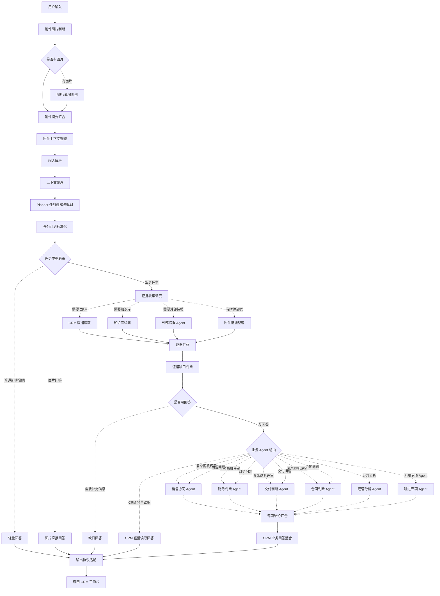

# 多Agent智能助手 V3 Stable Enhanced Chatflow 分析报告

> 目标产物：`chatflows/ai-deal-desk-v3.example.yml`  
> 分析日期：2026-07-06  
> 分析范围：节点拓扑、证据链路、Agent 路由、前端协议、只读边界、公开发布注意事项

## 一、当前定位

当前 V3 Stable Enhanced 已经从早期“固定路由分支 + 各分支独立 Answer”的结构，调整为更适合演示和长期维护的只读型多 Agent 工作台：

```text
用户输入
  -> 附件图片判断与摘要汇合
  -> 输入解析
  -> 上下文整理
  -> Planner 任务理解与规划
  -> 任务计划标准化
  -> 任务类型路由
  -> 证据收集调度
  -> 证据汇总
  -> 证据缺口判断
  -> 业务 Agent 路由
  -> 专项结论汇合
  -> CRM 业务回答整合
  -> 输出协议适配
  -> 返回 CRM 工作台
```

这版的核心价值不是让 AI 直接替人审批或写 CRM，而是在 CRM 工作台内完成“查上下文、收集证据、按需多 Agent 判断、输出建议和草稿”的闭环。

## 二、主流程拓扑

实线表示稳定主流程，虚线表示条件触发或按需执行：



## 三、关键节点职责

| 模块 | 当前职责 |
| --- | --- |
| 附件链路 | 判断是否有图片，识别图片/截图内容，并与前端附件摘要合并为本轮证据 |
| 输入解析 | 做轻量字段抽取，不直接给最终答案 |
| Planner | 判断任务类型、目标对象、所需证据、回答目标和需要哪些 Agent |
| 任务计划标准化 | 将 Planner 输出整理成后续路由可消费的结构化计划 |
| 任务类型路由 | 区分普通问答、图片问答和业务任务 |
| 证据收集调度 | 按需触发 CRM、知识库、外部情报、附件证据路径 |
| 证据汇总 | 将不同来源的证据整理成统一 evidence ledger |
| 证据缺口判断 | 判断是否需要先要求用户补充信息 |
| 业务 Agent 路由 | 按需启用销售、财务、交付、合同、经营分析或轻量 CRM 回答 |
| CRM 业务回答整合 | 将 Planner、证据台账和专项结论统一成用户可读 Markdown |
| 输出协议适配 | 输出 `DealDeskChatflowPayload`，供后端/前端稳定解析 |

## 四、当前任务类型与展示口径

| 用户意图 | 主要路径 | 原始 `turnType` | 页面展示口径 |
| --- | --- | --- | --- |
| 普通问答、概念解释 | 轻量回答 | `quick_answer` | 快速回答 |
| 图片/截图问答 | 图片直接回答 | `quick_answer` | 快速回答 |
| 查客户、查商机、列商机 | CRM 轻量读取 | `object_select` 或分析类文本 | Markdown 文本候选或摘要 |
| 商机进展总结、销售建议、话术、跟进计划 | 销售协同 Agent | `text_analysis` | 分析类 Markdown |
| 财务、交付、合同专项问题 | 对应专项 Agent | `text_analysis` | 分析类 Markdown |
| 复杂商机评审 | 销售、财务、交付、合同多 Agent | `deep_deal_review_brief` | 分析类 Markdown |
| 漏斗、收入、回款、转化统计 | 经营分析 Agent | `stats_query` | 分析类 Markdown |
| 保存、写入、创建跟进 | 只生成可复制草稿 | `text_analysis` | 草稿文本，不调用写回 |

`object_select`、`deep_deal_review_brief`、`stats_query` 是 DSL 原始业务类型，不需要在页面上变成用户可见标签。前端/后端可将它们按分析类回合体验展示。

## 五、只读边界

当前 V3 不调用 CRM 写回工具。用户说“保存到 CRM”“记一条跟进”“创建跟进计划”时，Chatflow 只生成可复制草稿，并说明当前版本不会执行写入。

保留 `writeback`、`writeback_confirm`、`writeback_result` 等协议能力，是为了兼容前端历史状态和后续恢复写回能力；它们不是当前 YAML 的执行目标。

## 六、知识库接入方式

知识库现在不是挂在某个固定分支后面，而是作为证据来源进入统一证据台账：

```text
evidence_router
  -> knowledge_gate
  -> query_rewrite
  -> deal_rules_knowledge
  -> knowledge_evidence
  -> evidence_ledger
  -> agent_router
```

规则知识只用于解释风险判断，不能替代 CRM 事实。CRM 没有确认的付款条件、验收范围、联系人、预算等字段，Agent 只能标为缺失或待确认，不能用知识库规则自行补全。

## 七、公开发布注意事项

- 公开仓库应使用脱敏后的 Chatflow 示例文件。
- Dify 应用密钥、模型供应商 API Key、Tavily Key、ngrok 固定域名授权、个人简历和真实账号信息都不应进入 GitHub。
- Tool API base URL 应写成环境变量或部署说明，不应绑定作者个人 ngrok。
- 规则知识库 dataset id 跨工作区通常不可直接复用，公开版需要提示导入后重新绑定知识库。
- 测试数据可以保留演示用假数据，但不要包含真实客户、真实联系人或真实简历信息。

## 八、结论

当前 V3 的主线已经更接近作品集应表达的能力：不是“多个 Prompt 堆在一起”，而是 Planner 规划、证据收集、按需多 Agent、统一回答和稳定前端协议的组合。

后续优先级应是：先完成只读链路部署演示和 GitHub 公开版说明，再把写回恢复作为独立阶段处理。
